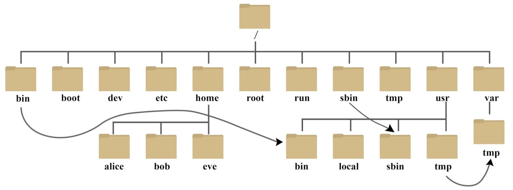

# Linux Tutorial

## 1. Linux 简介

### 1.1. Linux vs Windows

| 比较     | Windows                                                      | Linux                                                        |
| :------- | :----------------------------------------------------------- | :----------------------------------------------------------- |
| 界面     | 界面统一，外壳程序固定所有 Windows 程序菜单几乎一致，快捷键也几乎相同 | 图形界面风格依发布版不同而不同，可能互不兼容。GNU/Linux 的终端机是从 UNIX 传承下来，基本命令和操作方法也几乎一致。 |
| 驱动程序 | 驱动程序丰富，版本更新频繁。默认安装程序里面一般包含有该版本发布时流行的硬件驱动程序，之后所出的新硬件驱动依赖于硬件厂商提供。对于一些老硬件，如果没有了原配的驱动有时很难支持。另外，有时硬件厂商未提供所需版本的 Windows 下的驱动，也会比较头痛。 | 由志愿者开发，由 Linux 核心开发小组发布，很多硬件厂商基于版权考虑并未提供驱动程序，尽管多数无需手动安装，但是涉及安装则相对复杂，使得新用户面对驱动程序问题（是否存在和安装方法）会一筹莫展。但是在开源开发模式下，许多老硬件尽管在Windows下很难支持的也容易找到驱动。HP、Intel、AMD 等硬件厂商逐步不同程度支持开源驱动，问题正在得到缓解。 |
| 使用     | 使用比较简单，容易入门。图形化界面对没有计算机背景知识的用户使用十分有利。 | 图形界面使用简单，容易入门。文字界面，需要学习才能掌握。     |
| 学习     | 系统构造复杂、变化频繁，且知识、技能淘汰快，深入学习困难。   | 系统构造简单、稳定，且知识、技能传承性好，深入学习相对容易。 |
| 软件     | 每一种特定功能可能都需要商业软件的支持，需要购买相应的授权。 | 大部分软件都可以自由获取，同样功能的软件选择较少。           |

## 2. Linux 系统启动过程 

> Linux系统的启动过程可以分为5个阶段：
>
> - 内核的引导。
> - 运行 init。
> - 系统初始化。
> - 建立终端 。
> - 用户登录系统。

### 2.1. 内核引导

- 当计算机打开电源后，首先是BIOS开机自检，按照BIOS中设置的启动设备（通常是硬盘）来启动。

- 操作系统接管硬件以后，首先读入 /boot 目录下的内核文件。

### 2.2. 运行init

- init 进程是系统所有进程的起点，可以把它比拟成系统所有进程的老祖宗，没有这个进程，系统中任何进程都不会启动。

- init 程序首先是需要读取配置文件 /etc/inittab。

#### 2.2.1 运行级别

- 许多程序需要开机启动。在 Windows 叫做"服务"（service），在 Linux 就叫做"守护进程"（daemon）。init 进程的一大任务，就是去运行这些开机启动的程序。

- 但是，不同的场合需要启动不同的程序，比如用作服务器时，需要启动 Apache，用作桌面就不需要。

- Linux 允许为不同的场合，分配不同的开机启动程序，这就叫做"运行级别"（runlevel）。也就是说，启动时根据"运行级别"，确定要运行哪些程序。

##### Linux 系统有 7 个运行级别（runlevel）：

- 运行级别 0：系统停机状态，系统默认运行级别不能设为 0，否则不能正常启动
- 运行级别 1：单用户工作状态，root 权限，用于系统维护，禁止远程登录
- 运行级别 2：多用户状态（没有 NFS）
- 运行级别 3：完全的多用户状态（有 NFS），登录后进入控制台命令行模式
- 运行级别 4：系统未使用，保留
- 运行级别 5：X11 控制台，登录后进入图形 GUI 模式
- 运行级别 6：系统正常关闭并重启，默认运行级别不能设为 6，否则不能正常启动

### 2.3. 系统初始化

​	在init的配置文件中有这么一行： 

```shell
si::sysinit:/etc/rc.d/rc.sysinit
```

​	它调用执行了 `/etc/rc.d/rc.sysinit` ，而 `rc.sysinit` 是一个 bash shell 的脚本，它主要是完成一些系统初始化的工作。`rc.sysinit` 是每一个运行级别都要首先运行的重要脚本。它主要完成的工作有：激活交换分区，检查磁盘，加载硬件模块以及其它一些需要优先执行任务。

```shell
l5:5:wait:/etc/rc.d/rc 5
```

​	表示以 5 为参数运行 `/etc/rc.d/rc` ， `/etc/rc.d/rc` 是一个 Shell 脚本，它接受 5 作为参数，去执行 `/etc/rc.d/rc5.d/` 目录下的所有的 rc 启动脚本，`/etc/rc.d/rc5.d/` 目录中的这些启动脚本实际上都是一些连接文件，而不是真正的 rc 启动脚本，真正的 rc 启动脚本实际上都是放在 `/etc/rc.d/init.d/` 目录下。而这些rc启动脚本有着类似的用法，它们一般能接受 start、stop、restart、status 等参数。/etc/rc.d/rc5.d/ 中的 rc 启动脚本通常是 K 或 S 开头的连接文件，对于以 S 开头的启动脚本，将以 start 参数来运行。如果发现存在相应的脚本也存在 K 打头的连接，而且已经处于运行态了（以 `/var/lock/subsys/` 下的文件作为标志），则将首先以 stop 为参数停止这些已经启动了的守护进程，然后再重新运行。这样做是为了保证是当 init 改变运行级别时，所有相关的守护进程都将重启。至于在每个运行级中将运行哪些守护进程，用户可以通过 chkconfig 或 setup 中的"System Services"来自行设定。

### 2.4. 建立终端

​	rc 执行完毕后，返回 init。这时基本系统环境已经设置好了，各种守护进程也已经启动了。

​	init 接下来会打开 6 个终端，以便用户登录系统。在 inittab 中的以下 6 行就是定义了 6 个终端：

```shell
1:2345:respawn:/sbin/mingetty tty1
2:2345:respawn:/sbin/mingetty tty2
3:2345:respawn:/sbin/mingetty tty3
4:2345:respawn:/sbin/mingetty tty4
5:2345:respawn:/sbin/mingetty tty5
6:2345:respawn:/sbin/mingetty tty6
```

​	从上面可以看出在 2、3、4、5 的运行级别中都将以 respawn 方式运行 mingetty 程序，mingetty 程序能打开终端、设置模式。

​	同时它会显示一个文本登录界面，这个界面就是我们经常看到的登录界面，在这个登录界面中会提示用户输入用户名，而用户输入的用户将作为参数传给login程序来验证用户的身份。

### 2.5. 用户登录系统

​	一般来说，用户的登录方式有三种：

- 命令行登录
- SSH 登录
- 图形界面登录

​	对于运行级别为5的图形方式用户来说，他们的登录是通过一个图形化的登录界面。登录成功后可以直接进入 KDE、Gnome 等窗口管理器。

​	而文本方式登录的情况是：当看到mingetty的登录界面时，就可以输入用户名和密码来登录系统了。

​	Linux 的账号验证程序是 login，login 会接收 mingetty 传来的用户名作为用户名参数。然后 login 会对用户名进行分析：如果用户名不是 root，且存在 /etc/nologin 文件，login 将输出 nologin 文件的内容，然后退出。这通常用来系统维护时防止非root用户登录。只有/etc/securetty中登记了的终端才允许 root 用户登录，如果不存在这个文件，则 root 用户可以在任何终端上登录。

​	/etc/usertty 文件用于对用户作出附加访问限制，如果不存在这个文件，则没有其他限制。

### 2.6. 图形模式与文字模式的切换方式

​	Linux预设提供了六个命令窗口终端机让我们来登录。

- 默认登录的就是第一个窗口，也就是tty1，这个六个窗口分别为tty1,tty2 … tty6，可以按下 `Ctrl + Alt + F1 ~ F6` 来切换它们；
- 如果安装了图形界面，默认情况下是进入图形界面的，此时就可以按 `Ctrl + Alt + F1 ~ F6` 来进入其中一个命令窗口界面；
- 当进入命令窗口界面后再返回图形界面只要按下 `Ctrl + Alt + F7` 就回来了；
- 如果使用的 VMWARE 虚拟机，命令窗口切换的快捷键为 `Alt + Space + F1~F6`；
- 如果在图形界面下，请按 `Alt + Shift + Ctrl + F1~F6` 切换至命令窗口。

### 2.7. Linux 关机

​	在 Linux 领域内大多用在服务器上，很少遇到关机的操作。毕竟服务器上跑一个服务是永无止境的，除非特殊情况下，不得已才会关机。

​	正确的关机流程为：sync > shutdown > reboot > halt。关机指令为：shutdown ，可以 `man shutdown` 查看帮助文档。

​	例如可以运行如下命令关机：

```shell
sync # 将数据由内存同步到硬盘中。

shutdown # 关机指令

shutdown –h 10 # 计算机将在10分钟后关机

shutdown –h now # 立马关机

shutdown –h 20:25 # 系统会在今天20:25关机

shutdown –h +10 # 十分钟后关机

shutdown –r now # 系统立马重启

shutdown –r +10 # 系统十分钟后重启

reboot # 重启，等同于 shutdown –r now

halt # 关闭系统，等同于shutdown –h now 和 poweroff
```

​	不管是重启系统还是关闭系统，首先要运行 **sync** 命令，把内存中的数据写到磁盘中。

## 3. Linux 系统目录结构



以下是对这些目录的解释：

- **/bin**：
  bin 是 Binaries（二进制文件）的缩写，这个目录存放着最经常使用的命令。

- **/boot：**
  这里存放的是启动 Linux 时使用的一些核心文件，包括一些连接文件以及镜像文件。

- **/dev ：**
  dev 是 Device（设备）的缩写, 该目录下存放的是 Linux 的外部设备，在 Linux 中访问设备的方式和访问文件的方式是相同的。

- **/etc：**
  etc 是 Etcetera(等等) 的缩写，这个目录用来存放所有的系统管理所需要的配置文件和子目录。

- **/home**：
  用户的主目录，在 Linux 中，每个用户都有一个自己的目录，一般该目录名是以用户的账号命名的。

- **/lib**：
  lib 是 Library（库）的缩写这个目录里存放着系统最基本的动态连接共享库，其作用类似于 Windows 里的 DLL 文件。几乎所有的应用程序都需要用到这些共享库。

- **/lost+found**：
  这个目录一般情况下是空的，当系统非法关机后，这里就存放了一些文件。

- **/media**：
  linux 系统会自动识别一些设备，例如U盘、光驱等等，当识别后，Linux 会把识别的设备挂载到这个目录下。

- **/mnt**：
  系统提供该目录是为了让用户临时挂载别的文件系统的，我们可以将光驱挂载在 /mnt/ 上，然后进入该目录就可以查看光驱里的内容了。

- **/opt**：
  opt 是 optional（可选）的缩写，这是给主机额外安装软件所摆放的目录。比如你安装一个 ORACLE 数据库则就可以放到这个目录下。默认是空的。

- **/proc**：
  proc 是 Processes（进程）的缩写，/proc 是一种伪文件系统（也即虚拟文件系统），存储的是当前内核运行状态的一系列特殊文件，这个目录是一个虚拟的目录，它是系统内存的映射，可以通过直接访问这个目录来获取系统信息。这个目录的内容不在硬盘上而是在内存里，也可以直接修改里面的某些文件，比如可以通过下面的命令来屏蔽主机的ping命令，使别人无法ping你的机器：

  ```shell
  echo 1 > /proc/sys/net/ipv4/icmp_echo_ignore_all
  ```

- **/root**：
  该目录为系统管理员，也称作超级权限者的用户主目录。

- **/sbin**：
  s 就是 Super User 的意思，是 Superuser Binaries（超级用户的二进制文件）的缩写，这里存放的是系统管理员使用的系统管理程序。

- **/selinux**：
   这个目录是 Redhat/CentOS 所特有的目录，Selinux 是一个安全机制，类似于 windows 的防火墙，但是这套机制比较复杂，这个目录就是存放selinux 相关的文件的。

- **/srv**：
   该目录存放一些服务启动之后需要提取的数据。

- **/sys**：

  这是 Linux2.6 内核的一个很大的变化。该目录下安装了 2.6 内核中新出现的一个文件系统 sysfs 。sysfs 文件系统集成了下面3种文件系统的信息：针对进程信息的 proc 文件系统、针对设备的 devfs 文件系统、针对伪终端的 devpts 文件系统。该文件系统是内核设备树的一个直观反映。当一个内核对象被创建的时候，对应的文件和目录也在内核对象子系统中被创建。

- **/tmp**：
  tmp 是 temporary（临时）的缩写这个目录是用来存放一些临时文件的。

- **/usr**：
   usr 是 unix system resources（unix 系统资源）的缩写，这是一个非常重要的目录，用户的很多应用程序和文件都放在这个目录下，类似于 windows 下的 program files 目录。

- **/usr/bin：**
  系统用户使用的应用程序。

- **/usr/sbin：**
  超级用户使用的比较高级的管理程序和系统守护程序。

- **/usr/src：**
  内核源代码默认的放置目录。

- **/var**：
  var 是 variable（变量）的缩写，这个目录中存放着在不断扩充着的东西。将那些经常被修改的目录放在这个目录下，包括各种日志文件。

- **/run**：
  是一个临时文件系统，存储系统启动以来的信息。当系统重启时，这个目录下的文件应该被删掉或清除。如果你的系统上有 /var/run 目录，应该让它指向 run。

​	在 Linux 系统中，有几个目录是比较重要的，平时需要注意不要误删除或者随意更改内部文件。

- **/etc**： 这个是系统中的配置文件，如果更改了该目录下的某个文件可能会导致系统不能启动。

- **/bin, /sbin, /usr/bin, /usr/sbin**：这是系统预设的执行文件的放置目录，比如 **ls** 就是在 **/bin/ls** 目录下的。值得提出的是 **/bin**、**/usr/bin** 是给系统用户使用的指令（除 root 外的通用用户），而/sbin, /usr/sbin 则是给 root 使用的指令。

- **/var**： 这是一个非常重要的目录，系统上跑了很多程序，那么每个程序都会有相应的日志产生，而这些日志就被记录到这个目录下，具体在 /var/log 目录下，另外 mail 的预设放置也是在这里。

## 4. Linux 文件基本属性

​	Linux 系统是一种典型的多用户系统，不同的用户处于不同的地位，拥有不同的权限。为了保护系统的安全性，Linux 系统对不同的用户访问同一文件（包括目录文件）的权限做了不同的规定。

​	在 Linux 中，通常使用以下两个命令来修改文件或目录的所属用户与权限：

- `chown` (change owner) ： 修改所属用户与组。
- `chmod` (change mode) ： 修改用户的权限。

​	在 Linux 中，可以使用 `ll` 或者 `ls –l` 命令来显示一个文件的属性以及文件所属的用户和组：

```shell
[root@www /]# ls -l
total 64
dr-xr-xr-x   2 root root 4096 Dec 14  2012 bin
dr-xr-xr-x   4 root root 4096 Apr 19  2012 boot
……
```

​	上述执行结果表明：根文件夹下共有 64 个项目，第一个项目是 **bin** 文件夹。第一个字母表示项目的类型：

- 当为 **d** 则是目录；
- 当为 **-** 则是文件；
- 若是 **l** 则表示为链接文档（Link File）；
- 若是 **b** 则表示为装置文件里面的可供储存的接口设备（可随机存取装置）；
- 若是 **c** 则表示为装置文件里面的串行端口设备，例如键盘、鼠标（一次性读取装置）。

​	接下来的字符中，以三个为一组，且均为 **rwx** 的三个参数的组合。其中， **r** 代表可读(（read）、 **w** 代表可写（write）、 **x** 代表可执行（execute）。 三组组合分别表示：属主权限、属组权限、其他用户权限。

​	后面一次跟着：文件硬链接数量（number of hard links）、属主名（user/owner name）、属组名（group name）、文件大小（size）、文件最后修改时间（data/time last modified）、文件名（filename）。

**注意：**

- 三个权限（rwx）的位置不会改变，如果没有权限，就会出现减号 **-** 而已；

- 硬链接：两个文件的 inode 相同，指向同一个内存块。修改其中一个文件内容，所有文件都会改变；删除其中一个文件名，另外一个文件不受影响；
- 软连接：类似于 windows 的快捷方式，具有不同的 inode ，只是记录了文件的绝对路径，当路径修改，或文件名删除时，连接将失效。

### 4.1. Linux文件属主和属组

​	对于文件来说，它都有一个特定的所有者，也就是对该文件**具有所有权**的用户。同时，在Linux系统中，用户是按组分类的，一个用户属于一个或多个组。文件所有者以外的用户又可以分为文件所属组的**同组用户**和其他用户。

**注意：**对于 root 用户来说，一般情况下，文件的权限对其不起作用。

### 4.2. 更改文件属性

#### 4.2.1. chgrp

- 更改文件属组

```shell
chgrp [-R] 属组名 文件名
```

- **-R**：递归更改文件属组，就是在更改某个目录文件的属组时，如果加上 **-R** 的参数，那么该目录下的所有文件的属组都会更改。

#### 4.2.2. chown

- 更改文件所有者（owner），也可以同时更改文件所属组

```shell
chown [–R] 所有者 文件名
chown [-R] 所有者:属组名 文件名
```

#### 4.2.3. chmod

- 更改文件9个属性

> Linux 文件属性有两种设置方法：一种是数字，一种是符号。
>
> Linux 文件的基本权限就有九个，分别是 **owner/group/others（拥有者/组/其他）** 三种身份各有自己的 **read/write/execute** 权限。

​	文件的权限字符为： **-rwxrwxrwx** ，这九个权限是三个三个一组的。使用数字来代表各个权限，各权限的分数对照表如下：

- r : 4
- w : 2
- x : 1

​	每种身份（owner/group/others）各自的三个权限（r/w/x）分数是需要累加的。变更权限的指令 **chmod** 的语法是这样的：

```shell
 chmod [-R] xyz 文件或目录
```

- **xyz** : 就是刚刚提到的数字类型的权限属性，为不同身份 **rwx** 属性数值的相加；
- **-R** : 进行递归（recursive）的持续变更，以及连同次目录下的所有文件都会变更。

#### 4.2.4. 符号类型改变文件权限

​	还有一个改变权限的方法，可以使用 **u, g, o** 来代表三种身份的权限。此外， **a** 则代表 **all**，即全部的身份。读写的权限可以写成 **r, w, x**，也就是可以使用下表的方式来看：

<table>
  <td align='center'>chmod</td>
  <td align='center'>u g o a</td>
  <td align='center'>+(plus) -(minus) =(setting)</td>
  <td align='center'>r w x</td>
  <td align='center'>File or Directory</td>
</table>

```shell
chmod u=xxx,g=xxx,o=xxx/a=xxx filename
```

​	如果需要将文件权限设置为 **-rwxr-xr--** ，可以使用 `chmod u=rwx,g=rx,o=r 文件名` 来设定。

#### 4.2.5. 更多参考内容

- [Linux chgrp 命令](https://www.runoob.com/linux/linux-comm-chgrp.html)
- [Linux chown 命令](https://www.runoob.com/linux/linux-comm-chown.html)
- [Linux chmod 命令](https://www.runoob.com/linux/linux-comm-chmod.html)

## 5. Linux 文件与目录管理

​	Linux 的目录结构为树状结构，最顶级的目录为根目录 **/**。其他目录通过挂载可以将它们添加到树中，通过解除挂载可以移除它们。

- **绝对路径：**
  路径的写法，由根目录 **/** 写起，例如： /usr/share/doc 这个目录。

- **相对路径：**
路径的写法，不是由 **/** 写起，例如由 /usr/share/doc 要到 /usr/share/man 底下时，可以写成： **cd ../man** 这就是相对路径的写法。

### 5.1. 处理目录的常用命令

- **ls（list files）**：列出目录及文件名
- **cd（change directory）**：切换目录
- **pwd（print work directory）**：显示目前的目录
- **mkdir（make directory）**：创建一个新的目录
- **rmdir（remove directory）**：删除一个空的目录
- **cp（copy file）**：复制文件或目录
- **rm（remove）**：删除文件或目录
- **mv（move file）**：移动文件与目录，或修改文件与目录的名称

**注意：**可以使用 `man [命令]` 来查看各个命令的使用文档。

#### ls

- **-a ：**全部的文件，连同隐藏文件（开头为 . 的文件）一起列出来；
- **-d ：**仅列出目录本身，而不是列出目录内的文件数据；
- **-l ：**长数据串列出，包含文件的属性与权限等等数据；

#### cd

```shell
 cd [相对路径或绝对路径]
```

#### pwd

- **-P ：**显示出确实的路径，而非使用链接（link）路径。

```shell
cd /var/mail  # 注意：/var/mail是一个链接档，/var/mail -> spool/mail
pwd						# 列出目前的工作目录：/var/mail
pwd -P				# 列出确实路径：/var/spool/mail
```

#### mkdir

```shell
mkdir [-mp] 目录名称
```

- **-m ：**配置文件的权限：

  - ```shell
    mkdir -m xyz filename
    ```

- **-p ：**直接将所需要的多级目录递归创建起来。

#### rmdir

```shell
 rmdir [-p] 目录名称
```

- **-p ：**从该目录起，一次删除多级空目录。

**注意：** `rmdir` 仅能删除空的目录，可以使用 `rm` 命令来删除非空目录。

#### cp

```shell
cp [-adfilprsu] source destination
cp [options] source1 source2 source3 .... directory
```

- **-a ：**相当于 -pdr 的意思，至于 pdr 请参考下列说明；
- **-d ：**若来源档为链接档的属性（link file），则复制链接档属性而非文件本身；
- **-f ：**为强制（force）的意思，若目标文件已经存在且无法开启，则移除后再尝试一次；
- **-i ：**若目标档（destination）已经存在时，在覆盖时会先询问动作的进行；
- **-l ：**进行硬式链接（hard link）的链接档创建，而非复制文件本身；
- **-p ：**连同文件的属性一起复制过去，而非使用默认属性；
- **-r ：**递归持续复制，用於目录的复制行为；
- **-s ：**复制成为符号链接档 （symbolic link），亦即软链接；
- **-u ：**若 destination 比 source 旧才升级 destination 。

#### rm

```shell
 rm [-fir] 文件或目录
```

- **-f ：**force，忽略不存在的文件，不会出现警告信息；
- **-i ：**互动模式，在删除前会询问使用者是否动作；
- **-r ：**递归删除，最常用在目录的删除。

#### mv

```shell
mv [-fiu] source destination
mv [options] source1 source2 source3 .... directory
```

- **-f ：**force 强制的意思，如果目标文件已经存在，不会询问而直接覆盖；
- **-i ：**若目标文件 (destination) 已经存在时，就会询问是否覆盖；
- **-u ：**若目标文件已经存在，且 source 比较新，才会升级。

### 5.2. Linux 文件内容查看

- **cat ：**由第一行开始显示文件内容；
- **tac ：**从最后一行开始显示，可以看出 tac 是 cat 的倒着写；
- **nl ：**显示的时候，顺道输出行号；
- **more ：**一页一页的显示文件内容；
- **less ：**与 more 类似，但是比 more 更好的是，他可以往前翻页；
- **head ：**只看头几行；
- **tail ：**只看末尾几行。

> 可以使用 *`man [命令]`* 来查看各个命令的使用文档，如 ：man cp。
>

#### cat

> 由第一行开始显示文件内容
>

```shell
cat [-AbEnTv]
```

- **-A ：**相当于 -vET 的整合选项，可列出一些特殊字符而不是空白而已；
- **-b ：**列出行号，仅针对非空白行做行号显示，空白行不标行号；
- **-E ：**将结尾的断行字节 `$` 显示出来；
- **-n ：**列印出行号，连同空白行也会有行号；
- **-T ：**将 [tab] 按键以 `^I` 显示出来；
- **-v ：**列出一些看不出来的特殊字符。

#### tac

> 文件内容从最后一行开始显示
>

#### nl

> 显示行号
>

```shell
nl [-bnw] 文件
```

- **-b ：**指定行号编号的方式，主要有两种；
  - **-b a ：**表示不论是否为空行，也同样列出行号；
  - **-b t ：**如果有空行，空的那一行不要列出行号（默认值）；
  
- **-n ：**列出行号表示的方法，主要有三种；
  **-n ln ：**行号在荧幕的最左方显示；
  **-n rn ：**行号在自己栏位的最右方显示，且不加 0 ；
  **-n rz ：**行号在自己栏位的最右方显示，且加 0 ；
- **-w ：**行号栏位的占用的位数。

#### more

> 一页一页翻动
>

- **space ：**代表向下翻一页；
- **Enter ：**代表向下翻『一行』；
- **/string ：**代表在这个显示的内容当中，向下搜寻 string 这个关键字；
- **:f  ：**立刻显示出档名以及目前显示的行数；
- **q ：**代表立刻离开 more ，不再显示该文件内容。
- **b / ctrl + b ：**代表往回翻页，不过这动作只对文件有用，对管线无用。

#### less

> 一页一页翻动
>

- **space ：**向下翻动一页；
- **pagedown ：**向下翻动一页；
- **pageup ：**向上翻动一页；
- **/string ：**向下搜寻 string的功能；
- **?string ：**向上搜寻 string 的功能；
- **n ：**重复前一个搜寻 （与 / 或 ? 有关）
- **N ：**反向的重复前一个搜寻（与 / 或 ? 有关）
- **q ：**离开 less 这个程序；

#### head

> 取出文件前面几行
>

```shell
head [-n number] 文件 
```

- **-n ：**后面接数字，代表显示几行的意思；
  - 默认的情况中，显示前面 10 行。

#### tail

> 取出文件后面几行
>

```shell
tail [-n number] 文件 
```

- **-n ：**后面接数字，代表显示几行的意思；
- **-f ：**表示持续侦测后面所接的档名，要等到按下 `ctrl + c` 才会结束 tail 的侦测。

## 6. Linux 用户和用户组管理

​	Linux 系统是一个多用户多任务的分时操作系统，任何一个要使用系统资源的用户，都必须首先向系统管理员申请一个账号，然后以这个账号的身份进入系统。

​	用户的账号一方面可以帮助系统管理员对使用系统的用户进行跟踪，并控制他们对系统资源的访问；另一方面也可以帮助用户组织文件，并为用户提供安全性保护。每个用户账号都拥有一个唯一的用户名和各自的口令。用户在登录时键入正确的用户名和口令后，就能够进入系统和自己的主目录。

​	实现用户账号的管理，要完成的工作主要有：

- 用户账号的添加、删除与修改；
- 用户口令的管理；
- 用户组的管理。

### 6.1. Linux 系统用户账号的管理

​	用户账号的管理工作主要涉及到用户账号的添加、修改和删除。

#### 6.1.1. 添加用户

​	添加用户账号就是在系统中创建一个新账号，然后为新账号分配用户号、用户组、主目录和登录 Shell 等资源。刚添加的账号是被锁定的，无法使用。

```shell
useradd [-cdgGsu] username
```

- **-c ：**comment，用于指定一段注释性描述；
- **-d ：**目录 指定用户主目录，如果此目录不存在，则同时使用 -m 选项，可以创建主目录；
- **-g ：**指定用户所属的用户组；
- **-G ：**指定用户所属的附加组；
- **-s ：**Shell文件 指定用户的登录Shell；
- **-u ：**指定用户的用户号，如果同时有 -o 选项，则可以重复使用其他用户的标识号；
- **username ：**指定新账号的登录名。

> ​	增加用户账号就是在 `/etc/passwd` 文件中为新用户增加一条记录，同时更新其他系统文件如`/etc/shadow`、`/etc/group` 等。
>
> ​	Linux 提供了集成的系统管理工具 `userconf` ，它可以用来对用户账号进行统一管理。
>

#### 6.1.2. 删除帐号

​	如果一个用户的账号不再使用，可以从系统中删除。删除用户账号就是要将 `/etc/passwd` 等系统文件中的该用户记录删除，必要时还删除用户的主目录。

```shell
userdel [-r] username
```

- **-r ：**用于把用户的主目录一起删除。

#### 6.1.3. 修改帐号

​	修改用户账号就是根据实际情况更改用户的有关属性，如用户号、主目录、用户组、登录 Shell 等。

```shell
usermod [-cdmgGsu] username
```

> ​	常用的选项包括 `-c, -d, -m, -g, -G, -s, -u, -o`，这些选项的意义与 `useradd` 命令中的选项一样，可以为用户指定新的资源值。
>
> ​	另外，有些系统可以使用选项 `-l` 来指定新用户名。这个选项指定一个新的账号，即将原来的用户名改为新的用户名。

#### 6.1.4. 用户口令的管理

​	用户管理的一项重要内容是用户口令的管理。用户账号刚创建时没有口令，但是被系统锁定，无法使用，必须为其指定口令后才可以使用，即使是指定空口令。

​	指定和修改用户口令的 Shell 命令是 `passwd`。超级用户可以为自己和其他用户指定口令，普通用户只能用它修改自己的口令。命令的格式为：

```shell
passwd [-ludf] username
```

- **-l ：**锁定口令，即禁用账号。
- **-u ：**口令解锁。
- **-d ：**使账号无口令。
- **-f ：**强迫用户下次登录时修改口令。

> ​	普通用户修改自己的口令时，`passwd` 命令会先询问原口令，验证后再要求用户输入两遍新口令，如果两次输入的口令一致，则将这个口令指定给用户；而超级用户为用户指定口令时，就不需要知道原口令。
>

### 6.2. Linux 系统用户组的管理

​	每个用户都有一个用户组，系统可以对一个用户组中的所有用户进行集中管理。不同 Linux 系统对用户组的规定有所不同。用户组的管理涉及用户组的添加、删除和修改。组的增加、删除和修改实际上就是对/etc/group文件的更新。

#### 6.2.1. 增加用户组

```shell
groupadd [-go] usergroup
```

- **-g ：**group ID，指定新用户组的组标识号；
- **-o ：**一般与 -g 选项同时使用，表示新用户组的 GID 可以与系统已有用户组的 GID 相同。

#### 6.2.2. 删除用户组

```shell
groupdel usergroup
```

#### 6.2.3. 修改用户组的属性

```shell
groupmod [-gon] usergroup
```

- **-g ：**GID 为用户组指定新的组标识号；
- **-o ：**与 -g 选项同时使用，用户组的新 GID 可以与系统已有用户组的 GID 相同；
- **-n ：**将用户组的名字改为新名字。

#### 6.2.4. 切换用户组

​	如果一个用户同时属于多个用户组，那么用户可以在用户组之间切换，以便具有其他用户组的权限。

```shell
newgrp usergroup
```

### 6.3. 用户账号有关的系统文件

​	完成用户管理工作有许多种方法，但是每一种方法实际上都是对有关的系统文件进行修改。与用户和用户组相关的信息都存放在一些系统文件中，这些文件包括 `/etc/passwd` ，`/etc/shadow`，`/etc/group` 等。

#### 6.3.1. /etc/passwd

​	是用户管理工作涉及的最重要的一个文件。Linux 系统中的每个用户都在 `/etc/passwd` 文件中有一个对应的记录行，它记录了这个用户的一些基本属性。

```shell
用户名:口令:用户标识号:组标识号:注释性描述:主目录:登录Shell
```

##### 1. "用户名"

> 是代表用户账号的字符串。

​	通常长度不超过8个字符，并且由大小写字母和/或数字组成。登录名中不能有冒号，因为冒号在这里是分隔符。为了兼容起见，登录名中最好不要包含点字符(.)，并且不使用连字符(-)和加号(+)打头。

##### 2. ''口令''

> 一些系统中，存放着加密后的用户口令字。

​	虽然这个字段存放的只是用户口令的加密串，不是明文，但是由于 `/etc/passwd` 文件对所有用户都可读，所以这仍是一个安全隐患。因此，现在许多 Linux 系统都使用了 shadow 技术，把真正的加密后的用户口令字存放到 `/etc/shadow` 文件中，而在 `/etc/passwd` 文件的口令字段中只存放一个特殊的字符。

##### 3. ''用户标识号''

> 是一个整数，系统内部用它来标识用户。

​	一般情况下它与用户名是一一对应的。如果几个用户名对应的用户标识号是一样的，系统内部将把它们视为同一个用户，但是它们可以有不同的口令、不同的主目录以及不同的登录Shell等。

​	通常用户标识号的取值范围是 0 ~ 65535。0 是超级用户 root 的标识号，1～99由系统保留，作为管理账号，普通用户的标识号从100开始。在 Linux 系统中，这个界限是500。

##### 4. ''组标识号''

> 字段记录的是用户所属的用户组。

​	它对应着 `/etc/group` 文件中的一条记录。

##### 5. ''注释性描述''

> 字段记录着用户的一些个人情况。

​	这个字段并没有什么实际的用途。在不同的 Linux 系统中，这个字段的格式并没有统一。在许多 Linux 系统中，这个字段存放的是一段任意的注释性描述文字，用做 finger 命令的输出。

##### 6. ''主目录''

> 也就是用户的起始工作目录。

​	它是用户在登录到系统之后所处的目录。在大多数系统中，各用户的主目录都被组织在同一个特定的目录下,而用户主目录的名称就是该用户的登录名。各用户对自己的主目录有读、写、执行（搜索）权限，其他用户对此目录的访问权限则根据具体情况设置。

##### 7. ''登录 Shell''

> 用户登录后，要启动一个进程，负责将用户的操作传给内核，这个进程是用户登录到系统后运行的命令解释器或某个特定的程序。

​	Shell 是用户与 Linux 系统之间的接口。Linux 的 Shell 有许多种，每种都有不同的特点。系统管理员可以根据系统情况和用户习惯为用户指定某个 Shell 。如果不指定 Shell，那么系统使用 sh 为默认的登录 Shell，即这个字段的值为 `/bin/sh`。

​	用户的登录 Shell 也可以指定为某个特定的程序（此程序不是一个命令解释器）。利用这一特点，我们可以限制用户只能运行指定的应用程序，在该应用程序运行结束后，用户就自动退出了系统。有些 Linux 系统要求只有那些在系统中登记了的程序才能出现在这个字段中。

##### 8. 伪用户（pseudo users）

​	这些用户在 `/etc/passwd` 文件中也占有一条记录，但是不能登录，因为它们的登录 Shell 为空。它们的存在主要是方便系统管理，满足相应的系统进程对文件属主的要求。

​	常见的伪用户：

- **bin ：**拥有可执行的用户命令文件 
- **sys ：**拥有系统文件 
- **adm ：**拥有帐户文件 
- **uucp ：**UUCP 使用 
- **lp ：**lp 或 lpd 子系统使用 
- **nobody ：**NFS 使用

#### 6.3.2. /etc/shadow

> ​	由于 `/etc/passwd` 文件是所有用户都可读的，对安全性要求较高的 Linux 系统会把加密后的口令字分离出来，单独存放在一个文件中，这个文件是 `/etc/shadow` 文件。 有超级用户才拥有该文件读权限，这就保证了用户密码的安全性。
>

​	`/etc/shadow` 中的记录行与 `/etc/passwd` 一一对应，它由 `pwconv` 命令根据 `/etc/passwd` 中的数据自动产生。它的文件格式与 `/etc/passwd` 类似，由若干个字段组成，字段之间用 `:` 隔开。

```shell
登录名:加密口令:最后一次修改时间:最小时间间隔:最大时间间隔:警告时间:不活动时间:失效时间:标志
```

##### 1. "登录名"

> 与 `/etc/passwd` 文件中的登录名相一致的用户账号。

##### 2. "口令"

> 加密后的用户口令字，长度为13个字符。如果为空，则对应用户没有口令，登录时不需要口令；如果含有不属于集合 { ./0-9A-Za-z }中的字符，则对应的用户不能登录。

##### 3. "最后一次修改时间"

> 从某个时刻起，到用户最后一次修改口令时的天数。时间起点对不同的系统可能不一样。

##### 4. "最小时间间隔"

> 两次修改口令之间所需的最小天数。

##### 5. "最大时间间隔"

> 指的是口令保持有效的最大天数。

##### 6. "警告时间"

> 从系统开始警告用户到用户密码正式失效之间的天数。

##### 7. "不活动时间"

> 用户没有登录活动但账号仍能保持有效的最大天数。

##### 8. "失效时间"

> 一个绝对的天数，期满后，该账号不再是一个合法的账号，不能再用来登录。

#### 6.3.3. /etc/group

​	将用户分组是 Linux 系统中对用户进行管理及控制访问权限的一种手段。每个用户都属于某个用户组；一个组中可以有多个用户，一个用户也可以属于不同的组。

​	当一个用户同时是多个组中的成员时，在 `/etc/passwd` 文件中记录的是用户所属的主组，也就是登录时所属的默认组，而其他组称为附加组。用户要访问属于附加组的文件时，必须首先使用 `newgrp` 命令使自己成为所要访问的组中的成员。

​	用户组的所有信息都存放在 `/etc/group` 文件中。此文件的格式也类似于 `/etc/passwd` 文件，由冒号 `:` 隔开若干个字段。

```shell
组名:口令:组标识号:组内用户列表
```

##### 1. "组名"

> 用户组的名称，由字母或数字构成。与 `/etc/passwd` 中的登录名一样，组名不应重复。

##### 2. "口令"

> 字段存放的是用户组加密后的口令字。一般 Linux 系统的用户组都没有口令，这个字段一般为空，或者是*。

##### 3. "组标识号"

> 与用户标识号类似，也是一个整数，被系统内部用来标识组。

##### 4. "组内用户列表"

> 是属于这个组的所有用户的列表，不同用户之间用逗号(,)分隔。这个用户组可能是用户的主组，也可能是附加组。

### 6.4.  批量添加用户

#### 6.4.1. 编辑用户文本

​	每一列按照 `/etc/passwd` 密码文件的格式书写，要注意每个用户的用户名、UID、宿主目录都不可以相同，其中密码栏可以留做空白或输入 `x` 号。

```shell
user001::600:100:user:/home/user001:/bin/bash
user002::601:100:user:/home/user002:/bin/bash
...
```

#### 6.4.2. 创建用户

​	以 root 身份执行命令 `/usr/sbin/newusers`，从刚创建的用户文件 `user.txt` 中导入数据，创建用户。

```shell
newusers < user.txt
```

​	可以执行命令 `vipw` 或 `vi /etc/passwd` 检查 `/etc/passwd` 文件是否已经出现这些用户的数据，并且用户的宿主目录是否已经创建。

#### 6.4.3. 回写默认密码

​	执行命令 `/usr/sbin/pwunconv`。将 `/etc/shadow` 产生的 `shadow` 密码解码，然后回写到 `/etc/passwd` 中，并将 `/etc/shadow` 的 `shadow` 密码栏删掉。这是为了方便下一步的密码转换工作，即先取消 `shadow password` 功能。

```shell
pwunconv
```

#### 6.4.4. 编辑用户密码文件

```shell
user001:123456
user002:123456
...
```

#### 6.4.5. 修改默认密码

​	以 root 身份执行命令 `/usr/sbin/chpasswd`。创建用户密码，`chpasswd` 会将经过 `/usr/bin/passwd` 命令编码过的密码写入 `/etc/passwd` 的密码栏。

```shell
chpasswd < passwd.txt
```

#### 6.4.6. 编码密码

​	确定密码经编码写入/etc/passwd的密码栏后。执行命令 `/usr/sbin/pwconv` 将密码编码为 `shadow password`，并将结果写入 `/etc/shadow`。

```
pwconv
```

​	这样就完成了大量用户的创建了，之后可以到 `/home` 下检查这些用户宿主目录的权限设置是否都正确，并登录验证用户密码是否正确。

## 7. Linux 磁盘管理

​	Linux 磁盘管理好坏直接关系到整个系统的性能问题。Linux 磁盘管理常用三个命令为 **df**、**du** 和 **fdisk**。

- **df ：**（英文全称：disk free），列出文件系统的整体磁盘使用量；
- **du ：**（英文全称：disk used），检查磁盘空间使用量；
- **fdisk ：**用于磁盘分区。

### 7.1 df

​	检查文件系统的磁盘空间占用情况。可以利用该命令来获取硬盘被占用了多少空间，目前还剩下多少空间等信息。

```shell
df [-ahikHTm] [file-system]
```

- `-h` ：以人类可读的方式显示输出结果；
- `-T` ：显示文件系统的类型；
- `-t <文件系统类型>` ：只显示指定类型的文件系统；
- `-i` ：显示 inode 使用情况；
- `-H` ：该参数是 `-h` 的变体，但是使用 1000 字节作为基本单位而不是 1024 字节；这意味着它会以 SI（国际单位制）单位（例如 MB、GB）而不是二进制单位（例如 MiB、GiB）来显示磁盘使用情况；
- `-k` ：这个选项会以 KB 作为单位显示磁盘空间使用情况；
- `-a` ：该参数将显示所有的文件系统，包括虚拟文件系统，例如 `proc`、`sysfs` 等；如果没有使用该选项，默认情况下，`df` 命令不会显示虚拟文件系统。

### 7.2.  du

​	`du` 命令是对文件和目录磁盘使用的空间的查看。直接输入 `du` 没有加任何选项时，则 `du` 会分析当前所在目录里的子目录所占用的硬盘空间。

​	与 `df` 不一样的是，`du` 这个命令会直接到文件系统内去搜寻所有的文件数据。

```shell
du [-ahskm] [file]
```

- `-a` ：列出所有的文件与目录容量，默认仅统计目录底下的文件夹；
- `-h` ：以人们较易读的容量格式 (G/M) 显示；
- `-s` ：仅显示指定目录或文件的总大小，而不显示其子目录的大小；
- `-S` ：包括子目录下的总计，与 -s 有点差别；
- `-k` ：以 KBytes 列出容量显示；
- `-m` ：以 MBytes 列出容量显示。

### 7.3. fdisk

​	`fdisk` 是 Linux 的磁盘分区表操作工具。

```shell
fdisk [-l] device-name
```

- `-l` ：输出后面接的装置所有的分区内容。若仅有 fdisk -l 时， 则系统将会把整个系统内能够搜寻到的装置的分区均列出来。

### 7.4. 磁盘格式化

​	磁盘分割完后就要进行文件系统的格式化，使用 `mkfs`（make filesystem）命令。

```shell
mkfs [-t 文件系统格式] device-filename
```

- `-t` ：可以接文件系统格式，例如 ext3, ext2, vfat 等。

#### 7.4.1. 查看 mkfs 支持的文件格式

​	按下两个[tab]，会显示 `mkfs` 支持的文件格式。

### 7.5. 磁盘检验

​	`fsck`（file system check）用来检查和维护不一致的文件系统。若系统掉电或磁盘发生问题，可利用fsck命令对文件系统进行检查。

```shell
fsck [-t 文件系统] [-ACay] device-name
```

- `-t` : 给定文件系统的型式，若在 `/etc/fstab` 中已有定义或 kernel 本身已支援的则不需加上此参数；
- `-s` : 依序一个一个地执行 fsck 的指令来检查；
- `-A` : 对 `/etc/fstab` 中所有列出来的分区（partition）做检查；
- `-C` : 显示完整的检查进度；
- `-d` : 打印出 e2fsck 的 debug 结果；
- `-p` : 同时有 -A 条件时，同时有多个 fsck 的检查一起执行；
- `-R` : 同时有 -A 条件时，省略 / 不检查；
- `-V` : 详细显示模式；
- `-a` : 如果检查有错则自动修复；
- `-r` : 如果检查有错则由使用者回答是否修复；
- `-y` : 指定检测每个文件时自动输入 yes，在不确定哪里是不正常的时候，可以执行 `fsck -y` 全部检查修复。

#### 7.5.1. 查看 fsck 支持的 文件系统

​	按下两个[tab]，会显示 `fsck` 支持的文件格式。

#### 7.5.2. 强制检测

​	输入 `-f` 强制详细检测一个未出现问题的文件系统。如果没有加上 `-f` 的选项，则由于这个文件系统不曾出现问题，检查的经过非常快速。若加上 -f 强制检查，才会一项一项的显示过程。

### 7.6. 磁盘挂载与卸除

​	Linux 的磁盘挂载使用 `mount` 命令，卸载使用 `umount` 命令。

#### 7.6.1. 磁盘挂载

```shell
mount [-t 文件系统] [-L Label名] [-o 额外选项] [-n]  装置文件名  挂载点
```

#### 7.6.2. 磁盘卸载

```shell
umount [-fn] 装置文件名或挂载点
```

- -f ：强制卸除！可用在类似网络文件系统（NFS）无法读取到的情况下；
- -n ：不升级 /etc/mtab 情况下卸除。

## 8. Linux vi/vim

​	所有的 Unix Like 系统都会内建 vi 文书编辑器，其他的文书编辑器则不一定会存在。但是目前使用比较多的是 vim 编辑器。vim 具有程序编辑的能力，可以主动的以字体颜色辨别语法的正确性，方便程序设计。

​	相关文章：[史上最全Vim快捷键键位图 — 入门到进阶](https://www.runoob.com/w3cnote/all-vim-cheatsheat.html)

### 8.1. vi/vim 的使用

​	基本上 vi/vim 共分为三种模式，**命令模式**（Command Mode）、**输入模式**（Insert Mode）和**命令行模式**（Command-Line Mode）。

#### 8.1.1. 命令模式

​	此状态下敲击键盘动作会被 Vim 识别为命令，而非输入字符，比如我们此时按下 **i**，并不会输入一个字符，**i** 被当作了一个命令。

​	命令模式只有一些最基本的命令，因此仍要依靠**底线命令行模式**输入更多命令。以下是普通模式常用的几个命令：

- **i** -- 切换到输入模式，在光标当前位置开始输入文本；
- **x** -- 删除当前光标所在处的字符；
- **:** -- 切换到底线命令模式，以在最底一行输入命令；
- **a** -- 进入插入模式，在光标下一个位置开始输入文本；
- **o**：在当前行的下方插入一个新行，并进入插入模式；
- **O** -- 在当前行的上方插入一个新行，并进入插入模式；
- **dd** -- 剪切当前行；
- **yy** -- 复制当前行；
- **p**（小写） -- 粘贴剪贴板内容到光标下方；
- **P**（大写）-- 粘贴剪贴板内容到光标上方；
- **u** -- 撤销上一次操作；
- **Ctrl + r** -- 重做上一次撤销的操作；
- **:w** -- 保存文件；
- **:q** -- 退出 Vim 编辑器；
- **:q!** -- 强制退出Vim 编辑器，不保存修改。

#### 8.1.2. 输入模式

​	在命令模式下按下 **i** 就进入了输入模式，使用 **Esc** 键可以返回到命令模式。在输入模式中，可以使用以下按键：

- **字符按键以及Shift组合：**输入字符；
- **ENTER：**回车键，换行；
- **BACK SPACE：**退格键，删除光标前一个字符；
- **DEL：**删除键，删除光标后一个字符；
- **方向键：**在文本中移动光标；
- **HOME**/**END：**移动光标到行首/行尾；
- **Page Up**/**Page Down：**上/下翻页；
- **Insert：**切换光标为输入/替换模式，光标将变成竖线/下划线；
- **ESC：**退出输入模式，切换到命令模式；

#### 8.1.3. 底线命令模式

​	在命令模式下按下 `:` 就进入了底线命令模式。底线命令模式可以输入单个或多个字符的命令，可用的命令非常多。按 **ESC** 键可随时退出底线命令模式。在底线命令模式中，基本的命令有：

- `:w`：保存文件。
- `:q`：退出 Vim 编辑器。
- `:wq`：保存文件并退出 Vim 编辑器。
- `:q!`：强制退出Vim编辑器，不保存修改。

### 8.2. vi/vim 按键说明

#### 第一部分

> 一般模式可用的光标移动、复制粘贴、搜索替换等。

| 按键                                       | 操作                                                         |
| :----------------------------------------- | ------------------------------------------------------------ |
| h 或 向左箭头键(←)                         | 光标向左移动一个字符                                         |
| j 或 向下箭头键(↓)                         | 光标向下移动一个字符                                         |
| k 或 向上箭头键(↑)                         | 光标向上移动一个字符                                         |
| l 或 向右箭头键(→)                         | 光标向右移动一个字符                                         |
| [Ctrl] + [f]                               | 屏幕 [向下] 移动一页，相当于 [Page Down]                     |
| [Ctrl] + [b]                               | 屏幕 [向上] 移动一页，相当于 [Page Up]                       |
| [Ctrl] + [d]                               | 屏幕 [向下] 移动半页                                         |
| [Ctrl] + [u]                               | 屏幕 [向上] 移动半页                                         |
| +                                          | 光标移动到非空格符的下一行                                   |
| -                                          | 光标移动到非空格符的上一行                                   |
| n\<space>                                  | 那个 n 表示 [数字]。按下数字后再按空格键，光标会向右移动这一行的 n 个字符 |
| 0 或功能键 [Home]                          | 这是数字 [0] ：移动到这一行的最前面字符处                    |
| $ 或功能键 [End]                           | 移动到这一行的最后面字符处                                   |
| H                                          | 光标移动到这个屏幕的最上方那一行的第一个字符                 |
| M                                          | 光标移动到这个屏幕的中央那一行的第一个字符                   |
| L                                          | 光标移动到这个屏幕的最下方那一行的第一个字符                 |
| G                                          | 移动到这个档案的最后一行                                     |
| nG                                         | n 为数字。移动到这个档案的第 n 行。例如 20G 则会移动到这个档案的第 20 行 |
| gg                                         | 移动到这个档案的第一行，相当于 1G                            |
| n\<Enter>                                  | n 为数字。光标向下移动 n 行                                  |
| /word                                      | 向光标之下寻找一个名称为 word 的字符串                       |
| ?word                                      | 向光标之上寻找一个字符串名称为 word 的字符串                 |
| n                                          | 这个 n 是英文按键。代表重复前一个搜寻的动作                  |
| N                                          | 这个 N 是英文按键。与 n 刚好相反，为 [反向] 进行前一个搜寻动作 |
| :n1,n2s/word1/word2/g                      | n1 与 n2 为数字。在第 n1 与 n2 行之间寻找 word1 这个字符串，并将该字符串取代为 word2 |
| :1,$s/word1/word2/g 或 :%s/word1/word2/g   | 从第一行到最后一行寻找 word1 字符串，并将该字符串取代为 word2 |
| :1,$s/word1/word2/gc 或 :%s/word1/word2/gc | 从第一行到最后一行寻找 word1 字符串，并将该字符串取代为 word2 |
| x, X                                       | x 为向后删除一个字符， X 为向前删除一个字符                  |
| nx                                         | n 为数字，连续向后删除 n 个字符                              |
| dd                                         | 剪切游标所在的那一整行                                       |
| ndd                                        | n 为数字。剪切光标所在的向下 n 行                            |
| d1G                                        | 删除光标所在到第一行的所有数据                               |
| dG                                         | 删除光标所在到最后一行的所有数据                             |
| d$                                         | 删除游标所在处，到该行的最后一个字符                         |
| d0                                         | 删除游标所在处，到该行的最前面一个字符                       |
| yy                                         | 复制游标所在的那一行                                         |
| nyy                                        | n 为数字。复制光标所在的向下 n 行                            |
| y1G                                        | 复制游标所在行到第一行的所有数据                             |
| yG                                         | 复制游标所在行到最后一行的所有数据                           |
| y0                                         | 复制光标所在的那个字符到该行行首的所有数据                   |
| y$                                         | 复制光标所在的那个字符到该行行尾的所有数据                   |
| p, P                                       | p 为将已复制的数据在光标下一行贴上，P 则为贴在游标上一行     |
| J                                          | 将光标所在行与下一行的数据结合成同一行                       |
| c                                          | 重复删除多个数据                                             |
| u                                          | 复原前一个动作                                               |
| [Ctrl]+r                                   | 重做上一个动作                                               |
| .                                          | 小数点 [.]，重复删除、重复贴上等等动作                       |

#### 第二部分

> 一般模式切换到编辑模式的可用的按钮说明

| 按键  | 操作                                                         |
| :---- | ------------------------------------------------------------ |
| i, I  | i 为从目前光标所在处输入；I 为在目前所在行的第一个非空格符处开始输入 |
| a, A  | a 为从目前光标所在的下一个字符处开始输入；A 为从光标所在行的最后一个字符处开始输入 |
| o, O  | o 为在目前光标所在的下一行处输入新的一行；O 为在目前光标所在的上一行处输入新的一行 |
| r, R  | r 只会取代光标所在的那一个字符一次；R会一直取代光标所在的文字，直到按下 ESC 为止 |
| [Esc] | 退出编辑模式，回到一般模式中(常用)                           |

#### 第三部分

> 一般模式切换到指令行模式的可用的按钮说明

| 按键                | 操作                                                        |
| :------------------ | ----------------------------------------------------------- |
| :w                  | 将编辑的数据写入硬盘中                                      |
| :w!                 | 若文件属性为 [只读] 时，强制写入该档案                      |
| :q                  | 离开 vi                                                     |
| :q!                 | 使用 ! 为强制离开不储存档案                                 |
| :wq                 | 储存后离开，若为 :wq! 则为强制储存后离开                    |
| ZZ                  | 保存当前文件，然后退出                                      |
| ZQ                  | 不保存，强制退出                                            |
| :w [filename]       | 将编辑的数据储存成另一个文件                                |
| :r [filename]       | 将 [filename] 的文件内容加到游标所在行后面                  |
| :n1,n2 w [filename] | 将 n1 到 n2 的内容储存成 filename 这个档案                  |
| :!command           | 暂时离开 vi 到指令行模式下执行 command 的显示结果，不加空格 |
| :set nu             | 显示行号                                                    |
| :set nonu           | 隐藏行号                                                    |

## 9. Linux yum 命令

​	yum（ Yellow dog Updater, Modified）是一个在 Fedora 和 RedHat 以及 SUSE 中的 Shell 前端软件包管理器。基于 RPM 包管理，能够从指定的服务器自动下载 RPM 包并且安装，可以自动处理依赖性关系，并且一次安装所有依赖的软件包，无须繁琐地一次次下载、安装。yum 提供了查找、安装、删除某一个、一组甚至全部软件包的命令，而且命令简洁而又好记。

### 9.1. yum 语法

```shell
yum [options] [command] [package ...]
```

- **options：**可选操作；

  - **-h ：**帮助；

  - **-y ：**当安装过程提示选择全部为 "yes"；
  - **-q ：**不显示安装的过程
  - ......
- **command：**要进行的操作;
- **package：**安装的包名。

### 9.2. yum常用命令

- `yum check-update` ：列出所有可更新的软件清单命令；

- `yum update` ：更新所有软件命令；

- `yum install <package_name>` ：仅安装指定的软件命令；

- `yum update <package_name>` ：仅更新指定的软件命令；

- `yum list` ：列出所有可安裝的软件清单命令；

- `yum remove <package_name>` ：删除软件包命令；

- `yum search <keyword>` ：查找软件包命令。

- 清除缓存命令：
  - `yum clean packages` ：清除缓存目录下的软件包
  - `yum clean headers` ：清除缓存目录下的 headers
  - `yum clean oldheaders` ：清除缓存目录下旧的 headers
  - `yum clean` `yum clean all` = `yum clean packages; yum clean oldheaders` ：清除缓存目录下的软件包及旧的 headers。

### 9.3. 国内 yum 源

> ​	网易 yum 源是国内较好的 yum 源之一 。将 yum 源设置为163 yum，可以提升软件包安装和更新的速度，同时避免一些常见软件版本无法找到。
>

#### 9.3.1. 安装步骤

​	首先备份 `/etc/yum.repos.d/CentOS-Base.repo`

```shell
mv /etc/yum.repos.d/CentOS-Base.repo /etc/yum.repos.d/CentOS-Base.repo.backup
```

​	下载对应版本 repo 文件, 放入 `/etc/yum.repos.d/` （操作前请做好相应备份）

- [CentOS5](http://mirrors.163.com/.help/CentOS5-Base-163.repo) ：http://mirrors.163.com/.help/CentOS5-Base-163.repo
- [CentOS6](http://mirrors.163.com/.help/CentOS6-Base-163.repo) ：http://mirrors.163.com/.help/CentOS6-Base-163.repo
- [CentOS7](http://mirrors.163.com/.help/CentOS7-Base-163.repo) ：http://mirrors.163.com/.help/CentOS7-Base-163.repo

```shell
wget http://mirrors.163.com/.help/CentOS6-Base-163.repo
mv CentOS6-Base-163.repo CentOS-Base.repo
```

​	运行以下命令生成缓存：

```shell
yum clean all
yum makecache
```

#### 9.3.2. 其他源

- 中科大 yum 源：安装方法查看：https://lug.ustc.edu.cn/wiki/mirrors/help/centos ；

- 搜狐 yum 源安装方法查看: http://mirrors.sohu.com/help/centos.html ；

- 阿里云 yum 源：https://developer.aliyun.com/mirror/centos 。

## 10. Linux apt 命令

​	**apt**（Advanced Packaging Tool）是一个在 Debian 和 Ubuntu 中的 Shell 前端软件包管理器。apt 命令提供了查找、安装、升级、删除某一个、一组甚至全部软件包的命令，而且命令简洁而又好记。apt 命令执行需要超级管理员权限(root)。

### 10.1. apt 语法

```shell
apt [options] [command] [package ...]
```

- **options：**可选，选项包括 -h（帮助），-y（当安装过程提示选择全部为"yes"），-q（不显示安装的过程）等等；
- **command：**要进行的操作；
- **package**：安装的包名。

### 10.2. apt 常用命令

- `sudo apt update` ：列出所有可更新的软件清单命令；

- `sudo apt upgrade` ：升级软件包；

  - `apt list --upgradable` ：列出可更新的软件包及版本信息；

  - `sudo apt full-upgrade` ：升级软件包，升级前先删除需要更新软件包；

- `sudo apt install <package_name>` ：安装指定的软件命令；

  - `sudo apt install <package_1> <package_2> <package_3>` ：安装多个软件包；

- `sudo apt update <package_name>` ：更新指定的软件命令；

- `sudo apt show <package_name>` ：显示软件包具体信息,例如：版本号，安装大小，依赖关系等等；

- `sudo apt remove <package_name>` ：删除软件包命令；

- `sudo apt autoremove` ：清理不再使用的依赖和库文件； 

- `sudo apt purge <package_name>` ：移除软件包及配置文件； 

- `sudo apt search <keyword>` ：查找软件包命令； 

- `apt list --installed` ：列出所有已安装的包；

- `apt list --all-versions` ：列出所有已安装的包的版本信息。
