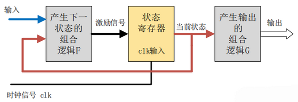
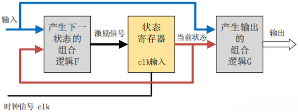

# Verilog

## 1. Verilog 基础教程

### 1.1. 基础语法

​	Verilog 是区分大小写的，格式自由，可以在一行内编写，也可以跨多行编写。每个语句必须以分号为结束符；空白符（`tab`、`space`、`enter`）都没有实际的意义，在编译阶段可以忽略。

#### 1.1.1. 注释

​	用 `//` 进行单行注释，用 `/* */` 进行多行注释。

#### 1.1.2. 标识符和关键字

​	标识符（identifier）可以是任意一组字母、数字、`$` 符号 和 `_` 符号的组合，但标识符的第一个字符必须是字母或者下划线，不能以数字或者美元开始。

​	关键字是 Verilog 中预留的用于定义语言结构的特殊标识符。Verilog 中关键字全部为小写。

### 1.2. 数值表示

#### 1.2.1. 数值种类

​	Verilog HDL 有下列四种基本的值来表示硬件电路中的电平逻辑。

- 0：逻辑 0 或 false；
- 1：逻辑 1 或 true；
- x：未知；
- z：高阻

​	`x` 意味着信号数值不确定，在实际电路里，信号可能为 1，也可能为 0；`z` 意味着信号处于高阻状态，常见于信号（input，reg）没有驱动时的逻辑结果，具体的逻辑值与实际电路中的上下拉有关，上拉为 1，下拉为 0。

#### 1.2.2. 整数数值表示

​	数字声明时，合法的技术格式有 4 种：十进制（`'d` 或 `'D`）、十六进制（`'h` 或 `'H`）、二进制（`'b` 或 `'B`）、八进制（`'o` 或 `'O`）。数据可指明位宽，也可不指明位宽。

##### 正数表示

```verilog
counter = 'd100 ;
counter = 100;
counter = 32'h64;
```

##### 负数表示

​	通常在位宽前加一个减号表示负数。

```verilog
counter = -6'd15
```

**注意**：减号放在基数和数字之间是非法的。

#### 1.2.3. 实数表示

##### 十进制

> 30.123
>
> 6.0
>
> 3.0
>
> 0.0001

##### 科学计数法

> 1.2e4
>
> 1_0001e4
>
> 1E-3

### 1.3. 数据类型

​	Verilog 最常用的 2 种数据类型就是线网 `wire` 与寄存器 `reg` ，其余类型可以理解为这两种数据类型的扩展辅助。

#### 1.3.1. 线网

​	`wire` 类型表示硬件单元之间的物理连线，由其连接的器件输出端连续驱动。如果没有驱动元件连接到 `wire` 型变量，缺省值一般为 `Z`。

```verilog
wire interrupt;
wire flag1, flag2;
wire gnd = 1'b0;
```

​	线网型还有其他数据类型，包括 `wand`，`wor`，`wri`，`triand`，`trior`，`trireg` 等。这些数据类型使用的频率不是很高。

#### 1.3.2. 寄存器

​	`reg` 用来表示存储单元，他会保持数据原有的值，直到被改写。

```verilog
reg clk_temp;
reg flag1, flag2;
```

#### 1.3.3. 向量

​	当位宽大于 1 时， `wire` 或 `reg` 即可声明为向量的形式。

```verilog
reg		[3:0]				couter 		;
wire 	[32-1:0] 		gpio_data ;
wire 	[8:2] 			addr			;
reg 	[0:31]			data			;
```

​	对于向量，可以指定某一位或若干相邻位，作为其他逻辑使用。

```verilog
wire 			[9:0] data_low = data[0:9] 	;
addr_temp	[3:2] = addr[8:7] + 1'b1		;
```

​	Verilog 还支持指定 bit 位后固定位宽的向量域选择访问。

- `[bit+:width]`：从起始 bit 位开始递增，位宽为 width；
- `[bit-:width]`：从起始 bit 位开始递减，位宽为 width 。

​	对信号重新组合成新的向量时，需要借助大括号。

```verilog
wire [31:0] 		temp1, temp2;
assign temp1 = {byte1[0][7:0], data1[31:8]};
assign temp2 = {32{1'b0}};
```

#### 1.3.4. 整型

​	整型类型用关键字 `integer` 声明，声明时不用指定位宽，位宽和编译器有关，一般为 32 bit 。`reg` 型变量为无符号数，而 `integer` 型变量为有符号数。

```verilog
reg [31:0] 	data1				;
reg [7:0] 	byte [3:0]	;
integer 		j						;		// 整型变量，用来辅助生成数字电路
always@* begin
  for (j=0; j<=3; j=j+1) begin
    byte1[j] = data1[(j+1)*8-1 : j*8];
  end
end
```

**注意**：综合后实际电路里并没有 `j` 这个信号，`j` 只是辅助生成相应的硬件电路。

#### 1.3.5. 实数

​	实数用关键字 `real` 来声明，可用十进制或科学计数法来表示。实数声明不能带有范围，默认值为 0 。如果将一个实数赋值给一个整数，则只有实数的整数部分会赋值给整数。

```verilog
real 			data1		;
integer 	temp		;
initial begin
	data1 = 2e3;
  data1 = 3.75;
end

initial begin
  temp = data1		; 	// temp 值的大小为 3
end
```

#### 1.3.6. 时间

​	Verilog 使用特殊的时间寄存器 `time` 型变量，对仿真时间进行保存。其宽度一般为 64 bit，通过调用系统函数 `$time` 获取当前仿真时间。

```verilog
time		current_time;
initial begin
	#100;
  current_time = $time ;	// current_time 的大小为 100
end
```

#### 1.3.7. 数组

​	在 Verilog 中允许声明 `reg` 、`wire` 、`integer` 、`time` 、`real` 及其向量类型的数组。数组维数没有限制。线网数组也可以用于连接实例模块的端口。数组中的每个元素都可以作为一个标量或者向量，以同样的方式来使用。

```verilog
integer				flag 			[7:0] 										;
reg 	[3:0]	 	counter 	[3:0]											; // 由 4 个 4 bit 计数器组成的数组
wire 	[7:0] 	addr_bus 	[3:0]											; // 由 4 个 8 bit wire 型变量组成的数组
wire  				data_bit 	[7:0][5:0]								;
reg 	[31:0] 	data_4d 	[11:0][3:0][3:0][255:0]		;
```

#### 1.3.8. 存储器

​	存储器变量就是一种寄存器数组，可用来描述 RAM 或 ROM 的行为。

```verilog
reg 				membit 	[0:255] 	;	// 256 bit 的 1 bit 存储器
reg		[7:0] mem 		[0:1023]	;	// 1 KB 存储器，位宽 1Byte = 8 bit
mem[511] = 8'b0								;	// 令第 511 个字节为 0
```

#### 1.3.9. 参数

​	参数用来表示常量，用关键字 `parameter` 声明，只能赋值一次。

```verilog
parameter	data_width = 10’d32 ;
parameter i=1, j=2,k=3 ;
parameter mem_size = data_width * 10 ;
```

​	通过实例化的方式，可以更改参数在模块中的值。

​	局部参数用 `localparam` 来声明，其作用和用法与 `parameter` 相同，区别在于它的值不能被改变。当参数只在本模块中调用时，可用 `localparam` 来声明。

#### 1.3.10. 字符串

​	字符串保存在 `reg` 类型的变量中，每个字符占用一个字节（8 bit）。因此寄存器变量的宽度应该足够大，以保证不会溢出。

​	字符串不能多行书写，即字符串中不能包含回车符。Verilog 将字符串当做一系列的单字节 ASCII 字符队列。

```verilog
reg [0: 14*8-1]    str;
initial begin
	str = "..."
end
```

##### 转义字符

| 转义字符 | 显示字符                 |
| -------- | ------------------------ |
| `\n`     | 换行                     |
| `\t`     | 制表符                   |
| `\`      | `\`                      |
| `%%`     | `%`                      |
| `\"`     | `"`                      |
| `\ooo`   | 1 到 3 个 8 进制数字字符 |

### 1.4. 表达式

​	表达式由操作符和操作数构成，其目的是根据操作符的意义得到一个计算结果。表达式可以在出现数值的任何地方使用。

#### 1.4.1. 操作数

​	操作数可以是任意的数据类型，只是某些特定的语法结构要求使用特定类型的操作数。操作数可以为常数、整数、实数、线网、寄存器、时间、位选、域选、存储器及函数调用等。

#### 1.4.2. 操作符

​	Verilog 中提供了大约 9 中操作符，分别是算术、关系、等价、逻辑、按位、归约、移位、拼接、条件操作符。

​	大部分操作符与 C 语言中类似。同类型操作符之间，除条件操作符（三目运算符）从右往左关联，其余操作符都是自左向右关联。圆括号内的表达式优先执行。

#### 1.4.3. 优先级

| 操作符       | 操作符号                   |
| :----------- | :------------------------- |
| 单目运算     | `+` `-` `!` `~`            |
| 乘、除、取模 | `*` `/` `%`                |
| 加减         | `+` `-`                    |
| 移位         | `<<`  `>>`                 |
| 关系         | `<`   `<=` `>` `>=`        |
| 等价         | `==`   `!=` `===` `!===`   |
| 归约         | `&` `~&` `^` `~^` `|` `~|` |
| 按位         | `~` `&` `|` `^` `~^`       |
| 逻辑与       | `&&`                       |
| 逻辑或       | `||`                       |
| 条件         | `? :`                      |

#### 1.4.4. 算术操作符

​	算术操作符包括单目操作符和双目操作符。如果操作数的其中一位为 X，则计算结果也会全部为 X 。

​	对变量进行声明时，要根据变量的操作符对变量的位宽进行合理声明，不要让结果溢出。

​	`+` 、`-` 也可以作为单目操作符使用，表示操作数的正负性。此类操作符的优先级最高。

#### 1.4.5. 关系操作符

​	关系操作符结果有两种，真（1），假（0）。

#### 1.4.6. 等价操作符

​	等价操作符包括逻辑相等（`==`）、逻辑不等（`!=`）、全等（`===`）、非全等（`!==`）。其结果有两种，真，假。

​	等价操作符不能比较 X 或 Z，当操作数包含一个 X 或 Z，则结果为不确定值；全等操作符可以按位比较 X 或 Z，返回结果也可以为 1 。

#### 1.4.7. 逻辑操作符

​	逻辑操作符主要有 3 个：`&&` （逻辑与）、`||`（逻辑或）、`!`（逻辑非）。其计算结果为一个 1 bit 的值，0 表示假，1 表示真，X 表示不确定。

​	如果一个操作数不为 0，它等价于逻辑 1；如果一个操作数等于 0，它等价于逻辑 0；如果任意一位为 X 或 Z，它等价于 X 。

​	如果任意一个操作数包含 X，逻辑操作符运算结果不一定为 X 。

#### 1.4.8. 按位操作符

​	按位操作符包括：取反（`~`）、与（`&`）、或（`|`）、异或（`^`）、同或（`~^`）。

​	按位操作符对两个操作数的每 1 bit 数据进行按位操作，如果两个操作数位宽不相等，则用 0 向左扩展补充较短的操作数。

#### 1.4.9. 归约操作符

​	归约操作符包括：归约与（`&`）、归约与非（`~&`）、归约或（`|`）、归约或非（`~|`），归约异或（`^`）、归约同或（`~^`）。

​	归约操作符只有一个操作数，它对这个操作数逐位进行操作，最终产生一个 1 bit 结果。

#### 1.4.10. 移位操作符

​	移位操作符包括：左移（`<<`）、右移（`>>`），算术左移（`<<<`）、算术右移（`>>>`）。

​	移位操作符是双目操作符，两个操作数分别表示要进行移位的向量信号与移动的位数。

​	算术左移和逻辑左移时，右边低位会补 0；逻辑右移时，左边高位会补 0，而算术右移时，左边高位会补符号位。

**注意**：算术左移会把最高位当做符号位处理，移位只在剩余位中进行。

#### 1.4.11. 拼接操作符

​	拼接操作符用大括号 `{, }` 表示，用于将多个操作数拼接成新的操作数，信号间用逗号隔开。

​	拼接符操作数必须指定位宽，常数也需要指定位宽。

#### 1.4.12. 条件操作符

​	条件表达式有 3 个操作符：

```verilog
condition_expression ? true_expression : false_expression
```

​	条件表达式类似于 2 路选择器，其描述方式完全可以用 `if-else` 语句代替，也可以进行嵌套，完成一次多次选择的逻辑。

#### 1.5. 编译指令

​	以反引号（`）开始的某些标识符是 Verilog 系统编译指令。

#### 1.5.1. \`define & \`undef

​	在编译阶段，\`define 用于文本替换，类似于 C 语言中的 `#define` 。一旦 \`define 指令被编译，其在整个编译过程中都会有效。

​	\`undef 用来取消之前的宏定义。

#### 1.5.2. \`ifdef \`ifndef \`elseif \`else \`endif

​	这些属于条件编译指令，用于根据定义情况，选择性地使用参数说明。

#### 1.5.3. \`include

​	使用 \`include 可以在编译时将一个 Verilog 文件内嵌到另一个 Verilog 文件中，作用类似于 C 语言中的 `#include` 结构。该指令通常用于将全局或公用的头文件包含在设计文件里。

​	文件路径既可以使用相对路径，也可以使用绝对路径。

#### 1.5.4. \`timescale

​	在 Verilog 模型中，时延有具体的单位时间表述，并用 \`timescale 编译指令将时间单位与实际时间相关联。

​	该指令用于定义时延、仿真的单位和精度。

```verilog
`timescale time_unit / time_precision
```

- `time_unit`：表示时间单位；
- `time_precision`：表示时间精度。

​	它们均是由数字以及单位组成。时间精度可以和时间单位一样，但是时间精度大小不能超过时间单位大小。

​	在编译过程中，\`timescale 指令会影响后面所有模块中的时延值，直至遇到另一个 \`timescale 指令或 \`resetall 指令。由于在 Verilog 中没有默认的 \`timescale，如果没有指定 \`timescale，Verilog 模块就会继承前面编译模块的 \`timescale 参数。

​	如果一个设计中的多个模块都带有 \`timescale，模拟器总是定位在所有模块中的最小时延精度上，并且所有时延都相应地换算为最小时延精度，时延单位并不受影响。

​	\`timescale 的时间精度设置是会影响仿真时间的，时间精度越小，仿真是占用内存越多，实际使用的仿真时间就越长。所以如果没有必要，应尽量将时间精度设置的大一点。

#### 1.5.5. \`default_nettype

​	该指令用于为隐式的线网变量指定类型，即将没有声明就使用的变量设置默认类型。

```verilog
`default_nettype wand	// 缺省为线与类型
`default_nettype none // 缺省不会自动产生 wire 变量
```

​	区别在于，指定默认类型，编译时只会产生警告，而不会产生错误；而不指定默认类型，如果未声明即使用，会产生错误，导致编译不通过。

#### 1.5.6. \`resetall

​	该编译器指令将所有的编译指令重新设置为缺省值。\`resetall 可以使得缺省连线类型为线网类型。将 \`resetall 添加到模块最后时，可以将当前的 \`timescale 取消放置进一步传递，只保证当前的 \`timescale 在局部有效，避免 \`timescale 的错误继承。

#### 1.5.7. \`celldefine & \`endcelldefine

​	这两个程序指令用于将模块标记为单元模块，包含模块的定义。

#### 1.5.8. \`unconnected_drive & \`nounconnected_drive

​	该指令用于，在模块实例化中，出现在这两个编译器指令间的任何未连接的输入端口，设置为正偏（上拉至高电平）电路状态或者反偏（下拉至低电平）电路状态。

```verilog
`unconnected_drive pull1
...
/* 在这两个程序指令间的所有未连接的输入端口为正偏电路状态 */
`nounconnected_drive

`unconnected_drive pull0
...
/* 在这两个程序指令间的所有未连接的输入端口为反偏电路状态 */
`nounconnected_drive
```

### 1.6. 连续赋值

#### 1.6.1. assign

​	连续赋值语句是 Verilog 数据流建模的基本语句，用于对 `wire` 型变量进行赋值。

​	Verilog 还提供了另一种对 `wire` 型赋值的简单方法，即在 `wire` 型变量声明的时候同时对其赋值。`wire` 型变量只能被赋值一次，因此该种连续赋值方式也只能有一次。

```verilog
assign LHS_target = RHS_expression ;
```

- `LHS`：Left Hand Side 指赋值操作的左侧；
- `RHS`：Right Hand Side 指赋值操作的右侧；

- `assign`：关键词，任何已经声明的 `wire` 型变量的连续赋值语句都是以 `assign` 开头。

**注意**：

1. `LHS_target` 必须是一个标量或者线性变量，而不能是寄存器类型；
2. `RHS_expression` 的类型没有要求，可以是标量或线型或寄存器向量，也可以是函数调用；
3. 只要 `RHS_expression` 表达式的操作数有事件发生时，`RHS_expression` 就会立刻重新计算，同时赋值给 `LHS_target` 。

### 1.7. 时延

#### 1.7.1. 时延

​	连续赋值延时语句中的延时，用于控制任意操作数发生变化到语句左端赋予新值之间的时间延时。时延一般是不可综合的。寄存器的时延也是可以控制的。

​	连续赋值时延一般可分为普通赋值时延、隐式时延、声明时延。

```verilog
// 普通时延，A&B 计算结果延时 10 个时间单位赋值给 Z
wire Z, A, B;
assign 
```

```verilog
// 隐式时延，声明一个 wire 型变量时对其进行包含一定时延的连续赋值
wire A, B;
wire #10 	Z = A & B;
```

```verilog
// 声明时延，声明一个 wire 型变量时指定一个时延，因此对该变量所有的连续赋值都会被推迟到指定的时间。除非门级建模中，一般不推荐使用此类方法建模
wire A, B;
wire #10 Z;
assign 		Z = A & B;
```

#### 1.7.2. 惯性时延

​	在上述例子中，A 或 B 任意一个变量发生变化，那么在 Z 得到新值之前，会有 10 个单位的时延。如果在 10 个时间单位内，即在 Z 获取新的值之前，A 或 B 任意一个值又发生了变化，那么计算 Z 的新值时会取 A 或 B 当前的新值。所以称之为惯性时延，即信号脉冲宽度小于时延时，对输出没有影响。

​	因此仿真时，时延一定要合理设置，放置某些信号不能进行有效的延迟。

### 1.8. 过程结构

#### 1.8.1. initial 语句

​	`initial` 语句从 0 时刻开始执行，只执行一次，多个 `initial` 块之间是相互独立的。如果 `initial` 块内包含多个语句，需要使用关键字 `begin` 和 `end` 组成一个块语句；如果 `initial` 块内只有一条语句，关键字 `begin` 和 `end` 可以省略。

​	`initial` 理论上来讲是不可综合的，多用于初始化、信号检测等。

#### 1.8.2. always 语句

​	与 `initial` 语句相反，`always` 语句是重复执行的。`always` 语句块从 0 时刻开始执行其中的行为语句；当执行完最后一条语句后，便再次执行语句块中的第一条语句，如此循环反复。

​	由于循环执行的特点，`always` 语句多用于仿真时钟的产生，信号行为的检测等。

### 1.9. 过程赋值

​	过程性赋值是在 `initial` 或 `always` 语句块里的赋值，赋值对象是寄存器、整数、实数等类型。这些变量在被赋值后，其值将保持不变，直到重新被赋予新值。

​	连续性赋值总是处于激活状态，任何操作数的改变都会影响表达式的结果，过程赋值只有在语句执行的时候，才会起作用。

#### 1.9.1. 阻塞赋值

​	阻塞赋值属于顺序执行，即在下一条语句执行前，当前语句一定会执行完毕。阻塞赋值语句使用 `=` 作为赋值符。

#### 1.9.2. 非阻塞赋值

​	非阻塞赋值属于并行执行语句，即下一条语句的执行和当前语句是同时进行的，它不会阻塞位于同一个语句块中后面语句的执行。非阻塞赋值使用 `<=` 作为赋值符。

**注意**：

1. `always` 时序逻辑块中多用非阻塞赋值，`always` 组合逻辑块中多用阻塞赋值；
2. `initial` 块中一般多用阻塞赋值。
3. 切记不要在一个过程结构中混合使用阻塞赋值与非阻塞赋值，两种赋值方法混用时，时序不同意控制，很容易得到意外的结果。

### 1.10. 时序控制

​	Verilog 提供了 2 大类时序控制方法：时延控制和事件控制。事件控制主要分为边沿触发事件控制与电平敏感事件控制。

#### 1.10.1. 时延控制

​	基于时延的时序控制出现在表达式中，它指定了语句从开始执行到执行完毕之间的时间间隔。时延可以是数字、标识符或者表达式。

​	根据在表达式中位置差异，时延控制又可以分为常规时延与内嵌时延。

##### 常规时延

​	遇到常规时延时，该语句需要等待一定时间，然后将计算结果赋值给目标信号。

```verilog
#10 value_general = value_test;
// 或者
#10;
value_general = value_test;
```

##### 内嵌时延

​	遇到内嵌时延时，该语句先将计算结果保存，然后等待一定的时间后赋值给目标信号。

```verilog
value_embed = #10 value_test;
```

**注意**：这两种时延控制方式的效果是有所不同的。

1. 当延时语句的赋值符号右端是常量时，2 种延时控制都能达到相同的延时赋值效果；
2. 当延时语句的赋值符号右端是变量时，2 种延时控制可能会有不同的赋值效果。

#### 1.10.2. 边沿触发事件控制

​	在 Verilog 中，事件是指某一个 `reg` 或 `wire` 型变量发生了值的变化。

##### 一般事件控制

​	事件控制用符号 `@` 表示。语句执行的条件是信号的值发生特定的变化。关键字 `posedge` 指信号发生边沿正向跳变，`negedge` 指信号发生负向边沿跳变，未指明跳变方向时，则 2 中情况的边沿变化都会触发相关事件。

```verilog
// 信号 clk 只要发生变化，就执行 q<=d，双边沿 D 触发器
always @(clk) q <= d ;
// 在信号 clk 上升沿时刻，执行 q<=d，正边沿 D 触发器
always @(posedge clk) q <= d ;
// 在信号 clk 下降沿时刻，执行 q<=d，正边沿 D 触发器
always @(negedge clk) q <= d ;
// 立刻计算 d 的值，并在 clk 上升沿时刻赋值给 q，不推荐这种写法
q = @(posedge clk) d ;
```

##### 命名事件控制

​	用户可以声明 `event` 类型的变量，并触发该变量来识别该事件是否发生。命名事件用关键字 `event` 来声明，触发信号用 `->` 表示。

```verilog
event start_receiving ;
always @( posedge clk_samp) begin
	-> start_receiving ;						// 采样时钟上升沿作为事件触发时刻
end

always @(start_receiving) begin
	data_buf = {data_if[0], data_if[1]} ;	// 触发时刻的事件行为
end
```

##### 敏感列表

​	当多个信号或事件中任意一个发生变化都能够触发语句的执行时，Verilog 中使用 `or` 来描述这种情况，用关键词 `or` 连接多个事件或信号。这些事件或信号组成的列表称为敏感列表。`or` 也可以用 `,` 代替。

```verilog
always @(posedge clk or negedge rstn) begin
// always @(posedge clk, negedge rstn) begin
```

​	当组合逻辑输入变量很多时，那么编写敏感列表会很繁琐。此时更为简洁的写法是 `@*` 或者 `@(*)`，表示对语句块中的所有输入变量的变化都是敏感的。

#### 1.10.3. 电平敏感

​	Verilog 中还支持使用电平作为敏感信号来控制时序，即后面语句的执行需要等待某个条件为真。Verilog 中使用关键字 `wait` 来表示这种电平敏感情况。

### 1.11. 语句块

#### 1.11.1. 顺序块

​	顺序块用关键字 `begin` 和 `end` 来表示。顺序块中的语句是一条一条执行的，非阻塞赋值除外。顺序块中每条语句的时延总是与其前面语句执行的时间相关。

#### 1.11.2. 并行块

​	并行块用关键字 `fork` 和 `join` 来表示。并行块中的语句是并行执行的，即使是阻塞形式的赋值。并行块中每条语句的时延都是与块语句开始执行的时间相关。

#### 1.11.3. 嵌套块

​	顺序块和并行块还可以嵌套使用。

```verilog
`timescale 1ns/1ns
module test;
	reg [3:0] ai_sequen2, bi_sequen2 ;
	reg [3:0] ai_paral2, bi_paral2 ;
	initial begin
		ai_sequen2 = 4'd5 ;					// at 0 ns
    	fork
        #10 ai_paral2 = 4'd5 ;	// at 10 ns
        #15 bi_paral2 = 4'd5 ;	// at 15 ns
      join
    	#20 bi_sequen2 = 4'd8 ;		// at 35 ns
  end
endmodule
```

#### 1.11.4. 命名块

​	可以给块语句结构命名。命名的块中可以声明局部变量，通过层次名引用的方法对变量进行访问。

```verilog
`timescale 1ns/1ns

module test;
  initial begin : wxss		// 命名模块名字为 wxss
    integer i ;						// 此变量可以通过 test.wxss.i 被其他模块使用
    i = 0 ;
    ...
  end
endmodule
```

​	命名块也可以被禁用，用关键字 `disable` 来表示。

```verilog
while (i_d <= 50) begin : test_b2
	#10
  if (i_d >= 50) begin
    disable test_b2								// stop 当前 block：test_b2
  end
  i_d = i_d + 10 ;
end
```

​	当 `i_d` 累加到 50 后，`diable` 退出了当前的 `while` 块。需要说明的是，在 `always` 和 `forever` 块中使用时只能退出当前循环，下一次语句会重新回到块开始。

### 1.12. 条件语句

​	条件（if）语句用于控制执行语句，要根据条件判断来确定是否执行。条件语句用关键字 `if` 和 `else` 来声明，条件表达式必须在圆括号内。

```verilog
if (condition1)					true_statement1   ;
else if (condition2)		true_statement2   ;
else if (condition3)		true_statement3   ;
else 										default_statement ;
```

- 判断过程与 C 语言类似；
- `true_statement` 等执行语句可以是一条语句，也可以是多条，如果是多条执行语句，需要用 `begin` 与 `end` 关键字进行说明。

### 1.13. 多路分支语句

​	`case` 语句是一种多路条件分支的形式，可以解决 `if` 语句中有多个条件选项时使用不方便的问题。

```verilog
case (case_expr)
	condition1		:			true_statement1 ;
	condition2		:			true_statement2 ;
	...
	default				:			default_statement ;
endcase
```

- `default` 语句是可选的，且在一个 `case` 语句中不能有多个 `default` 语句；
- 条件选项不要求互斥，虽然这些选项是并发比较的，但执行效果是谁在前且条件为真谁被执行；
- `true_statement` 等执行语句可以是一条语句，也可以是多条，如果是多条执行语句，则需要用 `begin` 与 `end` 关键字进行说明；
- `case` 语句支持嵌套使用。

#### 1.13.1. 多条件

​	`case` 语句中的 `condition` 也可以是多个，用 `,` 分隔。

```verilog
case (sel)
  2'b00: ... ;
  2'bx0, 2'bx1, 2'bxz: ... ;
  ...
endcase
```

#### 1.13.2. casex/casez 语句

​	`casex` 、`casez` 语句是 `case` 语句的变形，用来表示条件选项中的无关项。`casex` 用 `x` 来表示无关值，`casez` 用 `?` 来表示无关值，两者的实现的功能是完全一致的，语法与 `case` 语句也完全一致。

```verilog
casez (sel)
  4'b???1: ... ;
  4'b??1?: ... ;
  ...
endcase
```

### 1.14. 循环语句

#### 1.14.1. while 循环

​	`while` 循环中止条件为 `condition` 为假。如果开始执行到 `while` 循环时 `condition` 已经为假，那么循环语句一次也不会执行。执行语句只有一条时，关键字 `begin` 和 `end` 可以省略。

```verilog
while (condition) begin
	...
end
```

#### 1.14.2. for 循环

```verilog
for (initial_assignment; condition; step_assignment) begin
	...
end
```

- `initial_assignment`：为初始条件；
- `condition`：为终止条件，`condition` 为假时，立即跳出循环；
- `step_assignment`：为改变控制变量的过程赋值语句，通常为增加或减少循环变量计数。

**注意**：Verilog 不能简写自加自减运算符为 `++` 或 `--` 。

#### 1.14.3. repeat 循环

​	`repeat` 的功能是执行固定次数的循环，它不能像 `while` 循环那样用一个逻辑表达式来确定循环是否继续执行。`repeat` 循环的次数必须是一个常量、变量或信号。如果循环次数是变量信号，则循环次数是开始执行 `repeat` 循环时变量信号的值，即便执行期间，循环次数代表的变量信号值发生了变化，`repeat` 执行次数也不会改变。

```verilog
repeat (loop_times) begin
	...
end
```

#### 1.14.4. forever 循环

​	`forever` 语句表示永久循环，不包含任何条件表达式，一旦执行便无线的执行下去，系统函数 `$finish` 可退出 `forever` 。

```verilog
forever begin
  ...
end
```

### 1.15. 过程连续赋值

​	过程连续赋值是过程赋值的一种。这种赋值语句能够替换其他所有 `wire` 或 `reg` 的赋值，改写了 `wire` 或 `reg` 型变量的当前值。

​	与过程赋值不同的是，过程连续赋值的表达式能被连续的驱动到 `wire` 或 `reg` 型变量中，即过程连续赋值发生作用时，右端表达式中任意操作数的变化都会引起过程连续赋值语句的重新执行。

#### 1.15.1. assign，deassign

​	`assign`（过程赋值操作）与 `deassign`（取消过程赋值操作）表示第一类过程连续赋值语句。赋值对象只能是寄存器或寄存器组，而不能是 `wire` 型变量。

​	赋值过程中对寄存器连续赋值，寄存器中的值被保留直到被重新赋值。

#### 1.15.2. force，release

​	`force`（强制赋值操作）与 `release`（取消强制赋值）表示第二类过程连续赋值语句。

​	使用方法和效果，和 `assign` 与 `deassign` 类似，但赋值对象可以是 `reg` 型变量，也可以是 `wire` 型变量。

​	因为是无条件强制赋值，一般多用于交互式调试过程，不要在设计模块中使用。

​	当 `force` 作用在寄存器上，寄存器当前值被覆盖，`release` 时，该寄存器值将继续保留强制赋值时的值；当 `force` 作用在线网上时，线网值也会被强制赋值，但是一旦 `release` 该线网型变量，其值马上变为原有的驱动值。

### 1.16. 模块与端口

#### 1.16.1. 模块

​	模块是 Verilog 中基本单元的定义形式，是与外界交互的接口。

```verilog
module module_name
  #(parameter_list)
  (port_list) ;
  	Declarations_and_Statements ;
endmodule
```

- 模块必须以关键字 `module` 开始，以关键字 `endmodule` 结束；
- 模块名，端口信号，端口声明和可选的参数声明等，出现在设计使用的 Verilog 语句之前；
- 模块内部有可选的 5 部分组成，分别是变量声明、数据流语句、行为级语句、低层模块例化及任务和函数，这 5 部分出现顺序、出现位置都是任意的，但是，各种变量都应在使用之前声明，变量具体声明的位置不要求，但必须保证在使用之前的位置。

#### 1.16.2. 端口

​	端口是模块与外界交互的接口。对于外部环境来说，模块内部是不可见的，对模块的调用只能通过端口连接进行。

##### 端口列表

​	模块的定义中包含一个可选的端口列表，一般将不带类型、不带位宽的信号变量罗列在模块声明里。

```verilog
module module_name(
	DIN, OEN, PULL,
  DOUT, PAD);
endmodule
```

​	一个模块如果和外界环境没有交互，则可以不同声明端口列表。

##### 端口声明

​	端口信号在端口列表中罗列出来以后，可以在模块实体中进行声明。根据端口的方向，端口类型有 3 种：`input` 、`output` 、`inout` 。

​	`input` 、`inout` 类型不能声明为 `reg` 数据类型，因为 `reg` 类型是用于保存数值的，而输入端口只能反映与其相连的外部信号的变化，不能保存这些信号的值；`output` 可以声明为 `wire` 或 `reg` 数据类型。

​	在 Verilog 中，端口隐式的声明为 `wire` 型，即当端口具有 `wire` 属性时，不用再次声明端口类型为 `wire` ；但是当端口有 `reg` 属性时，则 `reg` 声明不可省略。

​	有一种更简洁常用的方法来声明端口，即在 `module` 声明时就陈列出端口及其类型。`reg` 型端口要么在 `module` 声明时声明，要么在 `module` 实体中声明。

```verilog
module module_name(
	input 			DIN  , OEN ,
  input [1:0] PULL ,
  output reg  DOUT
	);
  ...
endmodule
```

### 1.17. 模块例化

​	在一个模块中引用另一个模块，对其端口进行相关连接，叫做模块例化。模块例化建立了描述的层次。信号端口可以通过位置或名称关联，端口连接也必须遵循一些规则。

#### 1.17.1. 命名端口连接

​	这种方法将需要例化的模块端口与外部信号按照其名字进行连接，端口顺序随意，可以与引用 `module` 的声明端口顺序不一致，只要保证端口名字与外部信号匹配即可。

```verilog
full_adder1 u_adder_0(
  .Ai (a[0]),
  .Bi (b[0]),
  .Ci (c==1'b1 ? 1'b0 : 1'b1),
  .So (so_bit0),
  .Co (co_temp[0]));
```

​	如果某些输出端口并不需要在外部连接，例化时可以悬空不连接，甚至删除。一般来说，`input` 端口在例化时不能删除，否则编译报错，`output` 端口在例化时可以删除。

#### 1.17.2. 顺序端口连接

​	这种方法将需要例化的模块端口按照模块声明时端口的顺序与外部信号进行匹配连接，位置要严格保持一致。

```verilog
full_adder1 uadder1(
  a[1], b[1], co_temp[0], so_bit1, co_temp[1]);
```

​	虽然代码从书写上可能会占用相对较少的空间，但代码可读性降低，也不易于调试。有时候在大型的设计中可能会有很多个端口，端口信号的顺序时不时的可能也会有所改动，此时再利用顺序端口连接进行模块例化，显然是不方便的。所以平时，建议采用命名端口方式对模块进行例化。

#### 1.17.3. 端口连接规则

##### 输入端口

​	模块例化时，从模块外部来讲，`input` 端口可以连接 `wire` 或 `reg` 型变量，这与模块声明是不同的。从模块内部来讲，`input` 端口必须是 `wire` 型变量。

##### 输出端口

​	模块例化时，从模块外部来讲，`output` 端口必须连接 `wire` 型变量，这与模块声明是不同的，从模块内部来讲，`output` 端口可以是 `wire` 或 `reg` 型变量。

##### 输入输出端口

​	模块例化时，从模块外部来讲，`inout` 端口必须连接 `wire` 型变量，这与模块声明是相同的。

##### 悬空端口

​	模块例化时，如果某些信号不需要与外部信号进行连接交互，可以将其悬空，即端口例化处保留空白即可。`output` 端口正常悬空时，可以在例化时将其删除；`input` 端口正常悬空时，悬空信号的逻辑功能表现为高阻状态，但是，例化时一般不能将悬空的 `input` 端口删除，否则会编译报错。

##### 位宽匹配

​	当例化端口与连续信号位宽不匹配时，端口会通过无符号数的右对齐或截断方式进行匹配。

##### 端口连续信号类型

​	连接端口的信号类型可以是：标识符、位选择、部分选择、上述类型的合并和用于输入端口的表达式。

​	当然，信号名字可以与端口名字一样，但它们的意义是不一样的，分别代表 2 个模块内的信号。

#### 1.17.4. generate 例化

​	当例化多个相同的模块时，可以使用 `generate` 语句进行多个模块的例化，可大大简化程序的编写过程。

```verilog
// 第一个例化模块一般格式有所差异需要单独例化
full_adder1 u_adder0(
  .Ai		(a[0]),
  .Bi		(b[0]),
  .Ci		(c == 1'b1 ? 1'b1 : 1'b0),
  .So		(so[0]),
  .Co		(co_temp[0]);
)

genvar	i;
generate
  for(i = 1; i <= 3; i = i + 1) begin: adder_gen
    full_adder1 u_adder(
      .Ai		(a[i]),
      .Bi		(b[i]),
      .Ci		(co_temp[i-1]),		// 上一个全加器的溢位是下一个的进位
      .So		(so[i]),
      .Co		(co_temp[i]));
  end
endgenerate
```

#### 1.17.5. 层次访问

​	每一个例化模块的名字，每个模块的信号变量等，都使用一个特定的标识符进行定义。在整个层次设计中，每个标识符都具有唯一的位置与名字。

​	Verilog 中，通过使用一连串的 `.` 符号对各个模块的标识符进行层次分隔连接，就可以在任何地方通过制定完整的层次名对整个设计中的标识符进行访问。

### 1.18. 带参数例化

​	当一个模块被另一个模块引用例化，有时除开需要配置输入、输出信号外，还需要修改低层模块的部分参数。通过在例化时修改低层模块参数，可以在编译时将不同的参数传递给多个相同名字的模块，而不用单独为只有参数不同的多个模块再新建文件。

#### 1.18.1. defparam 语句

​	可以用关键字 `defparam` 通过模块层次调用的方法，来改写低层地模块的参数值。

```verilog
defparam	u_ram_4x4.MASK = 7;
```

#### 1.18.2. 带参数模块例化

​	另外一种方法就是在定义模块时，使用 `#()` 在端口声明时定义可以更改的参数列表，在例化模块时，将新的参数值写入模块例化语句，以此来改写原有 `module` 的参数值。

```verilog
ram #(.AW(4), .DW(4))
	u_ram
	(
		.CLK		(clk),
    .A			(a[AW-1:0])),
		.D			(d),
		.EN			(en),
		.WR			(wr),
		.Q			(q));
```

**注意**：

1. 可以不指定原有参数名字，按顺序进行参数例化；

2. `defparam` 也可以改写模块在端口声明时声明的参数，利用带参数例化也可以改写未在端口声明时声明，但在实体中声明的参数；

3. 可以混合使用两种模块参数的改写方法，改写在端口参数列表内的参数；

4. 如果模块具有端口声明参数，则不可以使用 `defparam` 改写其实体参数；

5. 对已有模块进行例化并将其相关参数进行改写时，不要采用 `defparam` 方法；
6. 模块在编写时，如果预知将被例化且有需要改写的参数，将这些参数写入到模块端口声明之前的地方。

## 2. Verilog 进阶教程

### 2.1. 函数

​	在 Verilog 中，可以利用任务（关键字 `task`）或函数（关键字 `function`），将重复性地行为级设计进行提取，并在多个地方调用，来避免重复代码的多次编写。

#### 2.1.1. 函数

​	函数只能在模块中定义，位置任意，并在模块的任何地方引用，作用范围也局限于此模块。

​	函数具有如下特点：

- 不含有任何延迟、时序或时序控制逻辑；
- 至少有一个输入变量；
- 只有一个返回值，且没有输出；
- 不含有非阻塞赋值语句；
- 函数可以调用其他函数，但是不能调用任务。

```verilog
function [range-1:0]		function_id;
	input_declaration ;
  other_declaration ;
  procedural_statement ;
endfunction
```

- 函数在声明时，会隐式的声明一个宽度为 `range`，名为 `function_id` 的寄存器变量，函数的返回值通过这个变量进行传递；

- 当没有指定位宽时，默认位宽为 1；

- 函数通过指明函数名与输入变量进行调用，函数结束时，返回值被传递到调用处。

	```verilog
	function_id(input1, input2, ...);
	```

#### 2.1.2. 常数函数

​	常数函数是指在仿真开始之前，在编译期间就计算出结果为常数的函数。常数函数不允许访问全局变量或者调用系统函数，但是可以调用另一个常数函数。

​	这种函数能够用来引用复杂的值，因此可用来代替常量。

#### 2.1.3. automatic 函数

​	在 Verilog 中，一般函数的局部变量是静态的，即函数的每次调用，函数的局部变量都会使用同一个存储空间。若某个函数在两个不同的地方同时并发地调用，那么两个函数调用行为同时对同一块地址进行操作，会导致不确定的函数结果。

​	Verilog 用关键字 `automatic` 来对函数进行说明，此类函数在调用时可以自动分配新的内存空间，也可以理解为是可递归的。因此，`automatic` 函数中声明的局部变量不能通过层次命名进行访问，但是 `automatic` 函数本身可以通过层次名进行调用。

### 2.2. 任务

#### 2.2.1. 任务与函数的区别

​	和函数一样，任务（`task`）可以用来描述共同的代码段，并在模块内任意位置被调用。函数一般用于组合逻辑的各种转换和计算，而任务更像一个过程，不仅能完成函数的功能还可以包含时序控制逻辑。

| 比较点   | 函数                                                 | 任务                                                    |
| -------- | ---------------------------------------------------- | ------------------------------------------------------- |
| 输入     | 函数至少有 1 个输入，端口声明不能包含 `inout` 型     | 任务可以没有或者有多个输入，且端口声明可以为 `inout` 型 |
| 输出     | 函数没有输出                                         | 任务可以没有或者有多个输出                              |
| 返回值   | 函数至少有 1 个返回值                                | 任务没有返回值                                          |
| 仿真时刻 | 函数总在零时刻就开始执行                             | 任务可以在非零时刻执行                                  |
| 时序逻辑 | 函数不能包含任何时序控制逻辑                         | 任务不能出现 `always` 语句，但可以包含其他时序控制      |
| 调用     | 函数只能调用函数，不能调用任务                       | 任务可以调用函数和任务                                  |
| 书写规范 | 函数不能单独作为一条语句出现，只能放在赋值语句的右端 | 任务可以作为一条单独的语句出现在语句块中                |

#### 2.2.2. 任务声明

​	任务在模块中任意位置定义，并在模块内任意位置引用，作用范围也局限于此模块。

```verilog
task		task_id ;
	port_declaration ;
	procedural_statement ;
endtask
```

​	任务中使用关键字 `input` 、`output` 和 `inout` 对端口进行声明。任务逻辑设计中，可以把 `input` 变量看做 `wire` ，`output` 变量看做 `reg` 。对 `output` 信号赋值时不需要使用 `assign` 。为避免时序错乱，建议 `output` 信号采用阻塞赋值。

```verilog
task	xor_oper_iner(
	input [N-1:0]		numa,
	input [N-1:0]		numb,
	output [N-1:0]	numco);
	#3 numco = numa ^ numb ;
endtask
```

#### 2.2.3. 任务调用

​	任务可以单独作为一条语句出现在 `initial` 或 `always` 块中。

```verilog
task_id(input1, input2, input3, ..., output1, output2, ...);
```

- 任务调用时，端口必须按顺序对应；
- 输入端连接的模块内信号可以是 `wire` 型， 也可以是  `reg` 型；输出连接的模块内信号要求一定是 `reg` 型。

#### 2.2.4. 操作全局变量

​	任务可以看做是过程性赋值，所以任务的 `output` 端信号返回时间是在任务中所有语句执行完毕之后。

​	任务内部变量也只有在任务中可见，如果想具体观察任务中对变量的操作过程，需要将观察的变量声明在模块之内、任务之外。

```verilog
reg		clk_test2;
task clk_rvs_global ;
  # 5 ;		cli_test2 = 0;
  # 5 ;		cli_test2 = 1;
endtask
always clk_rvs_global;
```

#### 2.2.5. automatic 任务

​	和函数一样，Verilog 中任务调用时的局部变量都是静态的。可以用关键字 `automatic` 来对任务进行声明，那么任务调用时各存储空间就可以动态分配，每个调用的任务都各自独立的对自己独有的地址空间进行操作，而不影响多个相同任务调用时的并发执行。

​	如果一个任务代码段被 2 处及以上调用，一定要用关键字 `automatic` 声明。

### 2.3. 状态机

​	有限状态机（Finite-State Machine，FSM），简称状态机，是表示有限个状态以及在这些状态之间的转移和动作等行为的数学模型。

#### 2.3.1. 状态机类型

​	Verilog 中状态机主要用于同步时序逻辑的设计，能够在有限个状态之间按一定要求和规律切换时序电路的状态。状态的切换方向不但取决于各个输入值，还取决于当前所在状态。

##### Moore 型

​	Moore 型状态机的输出只与当前状态有关，与当前输入无关。输出会在一个完整的时钟周期内保持稳定，即使此时输入信号有变化，输出也不会变化，输入对输出的影响要到下一个时钟周期才能反映出来。



##### Mealy 型

​	Mealy 型状态机的输出，不仅与当前状态有关，还取决于当前的输入信号。输出是在输入信号变化以后立刻发生变化，且输入变化可能出现在任务状态的时钟周期内。因此，在同种逻辑下，Mealy 型状态机输出对输入的响应会比 Moore 型状态机早一个时钟周期。



##### 状态机设计流程

​	根据设计需求画出状态转移图，确定使用状态机类型，并标注出各种输入输出信号，更有助于编程。

### 2.4. 竞争与冒险

#### 2.4.1. 产生原因

​	数字电路中，信号传输与状态变化时会有一定的延时。

- 在组合逻辑电路中，不同路径的输入信号变化传输到同一点门级电路时，在时间上有先有后，这种先后所形成的时间差称为竞争（Competition）；
- 由于竞争的存在，输出信号需要经过一段时间才能到达期望状态，过渡时间内可能产生瞬间错误输出，例如尖峰脉冲，这种现象称为冒险（Hazard）；
- 竞争不一定会有冒险，但冒险一定会有竞争。

#### 2.4.2. 判断方法

##### 代数法

​	在逻辑表达式中，保持一个变量固定不动，将剩余变量用 0 或 1 代替，如果最后逻辑表达式能化简成 $Y = A + A'$ 或 $Y = A \cdot A'$ 的形式，则可判定此逻辑存在竞争与冒险。

##### 卡诺图法

​	有两个相切的卡诺图，并且相切出没有其他卡诺圈包围，可能会出现竞争与冒险现象。卡诺图本质上还是对逻辑表达式的一个分析，只是可以进行直观的判断。

#### 2.4.3. 消除方法

​	对数字电路来说，常见的避免竞争与冒险的方法主要有 4 种。

##### 滤波电容

​	此种方法需要再输出端并联一个小电容，将尖峰脉冲的幅度削弱至门电路阈值以下。此方法虽然简单，但是会增加输出电压的翻转时间，易破坏波形。

##### 冗余项

​	利用卡诺图，在两个相切的圆之间，增加一个卡诺图，并加在逻辑表达式中。此时电路就不会再存在竞争与冒险。

##### 时钟同步电路

​	同步电路信号的变化都发生在时钟边沿，因而同步信号不会产生竞争冒险。实际应用中，可能存在异步信号，并且无法将其更改为同步信号，可以手动的在时钟边沿将异步信号赋值给另一信号，从而获得同步信号，使用这个同步信号进行后续的电路设计，这种设计思路叫做打拍。

​	延时一拍时钟时，会有一定概率减少竞争冒险的出现。实验表明，最安全的打拍延迟周期是 3 拍，可有效减少竞争冒险的出现。

##### 格雷码计数器

​	递加的多 bit 位计数器，计数值有时候会发生多个 bit 位的跳变。而格雷码计数器，计数时相邻的数之间只有一个数据 bit 发生了变化，所以能有效的避免竞争冒险。

#### 2.4.4. Verilog 书写规范

​	在编程时多注意以下几点，也可以避免大多数的竞争与冒险问题。

1. 时序电路建模时，用非阻塞赋值；
2. 组合逻辑建模时，用阻塞赋值；
3. 在同一个 `always` 块中建立时序和组合逻辑模型时，用非阻塞赋值；
4. 在同一个 `always` 块中不要既使用阻塞赋值又使用非阻塞赋值；
5. 不要在多个 `always` 块中为同一个变量赋值；
6. 避免 `latch` 产生。

### 2.5. 避免 Latch

​	锁存器（Latch）是电平触发的存储单元，数据存储的动作取决于输入时钟（或者使能）信号的电平值。仅当锁存器处于使能状态时，输出才会随着数据输入发生变化。

​	当电平信号无效时，输出信号随输入信号变化，就像通过了缓冲器；当电平有效时，输出信号被锁存，激励信号的任何变化，都将直接引起锁存器输出状态的改变。

#### 2.5.1. Latch 的危害

1. 输入状态可能多次变化，容易产生毛刺，增加了下一级电路的不确定性；
2. 在大部分 FPGA 的资源中，可能需要比触发器更多的资源去实现 Latch 结构；
3. 锁存器的出现是的静态时序分析变得更加复杂。

#### 2.5.2. 出现情形

##### if 结构不完整

​	组合逻辑中，不完整的 `if-else` 结构，会产生 Latch 。

```verilog
always @(*) begin
  if (en) q = data ;
end
```

​	缺少 `else` 分支，系统默认在 `else` 分支下保持寄存器 q 的值不变，即具有锁存功能，所以寄存器 q 会被综合成 Latch 结构。

​	但是在时序逻辑中，不完整的 `if-else` 结构，不会产生 Latch。这是因为寄存器 q 在时钟的边沿下才会改变，这是触发器（Flip-flop）的特性。

​	避免此类 Latch 的方法主要有 2 种，一种是补全 `if-else` 结构，或者对信号赋初值。

```verilog
always @(*) begin
  if (en) q = data ;
  else    q = 1'b0 ;
end

// or
always @(*) begin
  q = 1'b0 ;
  if (en) q = data ;
end
```

​	在组合逻辑中，当条件语句中有很多条赋值语句时，每个分支条件下赋值语句的不完整也是会产生 Latch 。通过对每个信号逻辑拆分来看，等同于 `if-else` 结构不完整，相关寄存器缺少在其他条件下的赋值行为。

```verilog
module module1_latch11(
	input					data1,
  intpu 				data2,
  input					en ,
  output reg 		q1 ,
  output reg 		q2);
  
  always @(*) begin
    if (en)			q1 = data1 ;
    else				q2 = data2 ;
  end
endmodule
```

​	这种情况也可以通过补充完整赋值语句或赋初值来避免 Latch 。

##### case 结构不完整

​	`case` 语句产生 Latch 的原理几乎与 `if` 语句一致。在组合逻辑中，当 `case` 选项列表不全且没有加 `default` 关键字，或有多个赋值语句不完整时，也会产生 Latch 。

```verilog
module module_latch2(
	input				 data1,
	input				 data2,
  input	[1:0]	 sel ,
  output reg q ) ;
  
  always @(*) begin
    case(sel)
      2'b00: q = data1 ;
      2'b01: q = data2 ;
    endcase
  end
  
endmodule
```

​	消除此种 Latch 的方法也是 2 种，将 `case` 选项列表补充完整，或对信号赋初值。补充完整 `case` 选项列表时，可以罗列所有的选项结果，也可以用 `default` 关键字来代替其他选项结果。

```verilog
always @(*) begin
  case(sel)
    2'b00:		q = data1 ;
    2'b01: 		q = data2 ;
    default: 	q = 1'b0 ;
    // or
    // 2'b10, 2'b11: q = 1'b0 ;
  endcase
end
```

##### 原信号赋值或判断

​	在组合逻辑中，如果一个信号的赋值源头有其信号本身，或者判断条件中有其信号本身的逻辑，也会产生 Latch 。因为此时信号也需要具有存储功能，但是没有时钟驱动。

```verilog
// signal itself ad a part of condition
reg a, b;
always @(*) begin
  if (a & b) a = 1'b1 ;		// a -> latch
  else a = 1'b0 ;
end

// signal itself are the assignment source
reg			c ;
wire [1:0] sel ;
always @(*) begin
  case(sel)
    2'b00:		c = c ;			// c -> latch
    2'b01:		c = 1'b1 ;
    default: 	c = 1'b0 ;
  endcase
end

//signal itself as a part of condition in "? expression"
wire		d, sel2 ;
assign	d = (sel2 && d) ? 1'b0 : 1'b0 ;	// d -> latch
```

​	避免此类 Latch 的方法，就只有一种，即在组合逻辑中避免这种写法，信号不要给信号自己赋值，且不要用赋值信号本身参与判断条件逻辑。或者在不要求立刻输出信号的时候，将信号进行一个时钟周期的延时，再进行相关逻辑的组合。

##### 敏感信号列表不完整

​	组合逻辑中 `always@()` 块内敏感列表没有列全，该触发的时刻没有触发，那么相关寄存器还是会保存之前的输出结果，因而会生成锁存器。

​	这种情况下，把敏感信号不全或者直接用 `always@(*)` 即可消除 Latch 。

### 2.6. 仿真激励

​	Verilog 代码设计完成后，需要进行重要的步骤，即逻辑功能仿真。仿真激励文件称之为 testbench，放在各设计模块的顶层，以便对模块进行系统性的例化调用进行仿真。

​	根据设计的复杂度，需要引入时钟和复位部分。

#### 2.6.1. 具体分析

##### 信号声明

​	testbench 模块声明时，一般不需要声明端口，因为激励信号一般都在 testbench 内部，没有外部信号。声明的变量应该能全部对应被测试模块的端口，变量不一定与被测试模块端口同名，但是类型需要相同。

##### 时钟生成

​	利用取反方法生成时钟，一定要给 `clk` 寄存器赋初值；利用参数的方法指定时间延迟时，如果延时参数为浮点数，该参数不要声明为 `parameter` ，`timescale` 的精度也需要提高，单位和精度不能一样，否则小数部分的时间延迟赋值也将不起作用。

##### 复位生成

​	复位逻辑比较简单，一般赋初值为 0，在经过一段小延迟后，复位为 1 即可。

##### 激励部分

​	激励部分该产生怎么样的输入信号，是根据被测试模块的需要来设计的。

##### 模块例化

​	利用 testbench 开始声明的信号变量，对被测试模块进行例化连接。

##### 自校验

​	如果设计比较简单，完全可以通过输入、输出信号的波形来确定设计是否正确，此部分完全可以删除；如果数据很多，有时候拿肉眼观察并不能对设计的正确性进行一个有效判定。此时加入一个自校验模块，会大大增加仿真的效率。

##### 结束仿真

​	如果我们不加入结束仿真部分，仿真就会无限制的运行下去，波形太长有时候并不方便分析。Verilog 中提供了系统任务 `$finish` 来停止仿真。停止仿真之前，可以将自校验的结果，通过系统任务 `$display` 在终端进行显示。

#### 2.6.2. 文件读写选项

​	用于打开文件的系统任务 `$fopen` 格式如下：

```verilog
fd = $fopen("<name_of_file>", "mode");
```

​	与 C 语言类似，打开方式的选项 `mode` 意义如下：

| mode  | 意义                                                         |
| ----- | ------------------------------------------------------------ |
| `w`   | 只写打开一个文本文件；如果文件存在，则原文件内容会被删除，如果文件不存在，则创建新文件 |
| `a`   | 追加打开一个文本文件，并在文件末尾写数据；如果文件不存在，则创建新文件 |
| `rb`  | 只读打开一个二进制文件，只允许读数据                         |
| `wb`  | 只写打开一个二进制文件，只允许写数据                         |
| `ab`  | 追加打开一个二进制文件，并在文件末尾写数据                   |
| `r+`  | 读写打开一个文本文件，允许读和写                             |
| `w+`  | 读写打开或建立一个文本文件，允许读写；如果文件存在，则原文件内容会被删除，如果文件不存在，则创建新文件 |
| `a+`  | 读写打开一个文本文件，允许读和写；如果文件不存在，则创建新文件，读取文件会从文件起始地址开始，写入只能是追加模式 |
| `rb+` | 读写打开一个二进制文本文件，功能和 `r+` 类似                 |
| `wb`  | 读写打开或建立一个二进制文本文件，功能和 `w+` 类似           |
| `ab+` | 读写打开一个二进制文本文件，功能和 `a+` 类似                 |

### 2.7. 流水线

​	硬件描述语言的一个突出有点就是指令执行的并行性。多条语句能够在相同时钟周期内并行处理多个信号数据。但是当数据串行输入时，指令执行的并行性并不能体现出其优势。并且很多时候计算并不能在一个或者两个时钟周期内执行完毕，如果每次输入的串行数据都需要等待上一次计算执行完毕后才能开启下一次的计算，那效率是相当低的。流水线就是解决多周期下串行数据计算效率低的问题。

#### 2.7.1. 基本思想

​	把一个重复的过程分解为若干个子过程，每个子过程由专门的功能部件来实现。将多个处理过程在时间上错开，依次通过各功能段，这样每个子过程就可以与其它子过程并行进行。

## 3. Verilog 高级教程

### 3.1. 编码风格

#### 3.1.1.

​	信号变量、模块等一定要使用有意义的名字，且信号名称在模块间穿梭时也应该保持不变，以便代码本身就具有清晰的说明信息，增强可读性。

​	当名字单词数量过多时，可以使用 `_` 进行拼接。

​	建议使用单词缩写的方式对信号进行命名，并懂得取舍，避免过长的信号命名。

​	虽然 Verilog 区分大小写，但是建议一般功能模块的名称、端口、信号变量等全部使用小写，`parameter` 使用大写，一些电源、Pad 等特殊端口使用大写。只为编写代码方便，容易区分变量常量，不用考虑大小写不一样但名字相同的信号变量的差异。
​	寄存器变量一般加后缀 `_r` ，延迟打拍的变量加后缀 `_r1` 、`_r2` 等。主要有两大好处，一是 RTL 设计时容易根据变量类型对数据进行操作；二是综合后网表的信号名字经常会改变，加入后缀容易在综合后的网表中找到与 RTL 中对应的信号变量。

​	其他后缀：`_d` 可以表示延迟后的信号，`_t` 可以表示暂时存储的信号，`_n` 可以表示低电平有效的信号，`_s` 可以表示 slave 信号，`_m` 可以表示 master 信号等。

​	避免使用关键字对信号进行命名。

​	文件名保持与设计的 `module` 名字一致，文件内尽量只包含一个设计模块。

#### 3.1.2. 注释

​	每一个设计模块开头，都应该包含文件说明信息，包括版权、模块名字、作者、日期、梗概、修改记录等信息。

```verilog
/**********************************************************
// Copyright 1891.06.02-2017.07.14
// Contact with willrious@sina.com
================ runoob.v ======================
>> Author       : wxss
>> Date         : 2025.09.07
>> Description  : Welcome
>> note         : (1)To 
>>              : (2)My
>> V180121      : World.
************************************************************/
```


